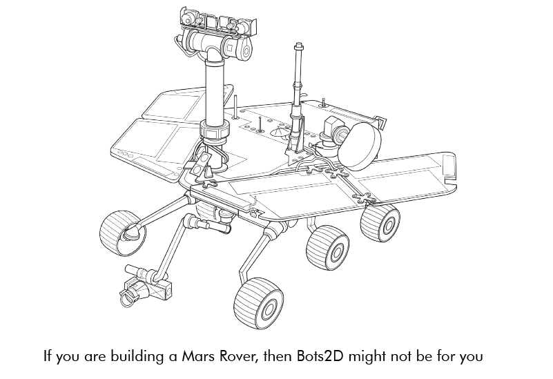
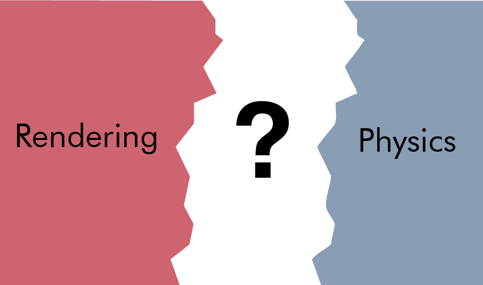

import animate_rect_mp4 from "./animate_rect.mp4"
import animate_rect_webm from "./animate_rect.webm"

import animate_wheel_mp4 from "./animate_wheel.mp4"
import animate_wheel_webm from "./animate_wheel.webm"

import both_sensor_mp4 from "./both_sensor.mp4"
import both_sensor_webm from "./both_sensor.webm"

import camera_movement_mp4 from "./camera_movement.mp4"
import camera_movement_webm from "./camera_movement.webm"

import keyboard_control_mp4 from "./keyboard_control.mp4"
import keyboard_control_webm from "./keyboard_control.webm"

import line_detector_mp4 from "./line_detector.mp4"
import line_detector_webm from "./line_detector.webm"

import range_sensor_mp4 from "./range_sensor.mp4"
import range_sensor_webm from "./range_sensor.webm"

import rendering_and_physics_mp4 from "./rendering_and_physics.mp4"
import rendering_and_physics_webm from "./rendering_and_physics.webm"

import robot_rotation_mp4 from "./robot_rotation.mp4"
import robot_rotation_webm from "./robot_rotation.webm"

import sumobot_testscene_mp4 from "./sumobot_testscene.mp4"
import sumobot_testscene_webm from "./sumobot_testscene.webm"

import wheel_motor_friction_mp4 from "./wheel_motor_friction.mp4"
import wheel_motor_friction_webm from "./wheel_motor_friction.webm"

In this post, I will take you through a project I built over the last months.
A C++ framework for simulating robots in 2D called [Bots2D](https://github.com/artfulbytes/bots2d). Short of 5000 lines,
it's not a huge project, but it's the largest C++ project I built on my own, and it has taught me
a lot.

<Video mp4={sumobot_testscene_mp4} webm={sumobot_testscene_webm} />

This is not meant as a step-by-step tutorial. Instead, I walk you through
the design problems I encountered, how I dealt with them, and what I
learned from them.

## Background
I'm building a [sumobot](/sumobot), a small robot meant to push other bots
out of a ring. I've assembled it and can control it remotely, but in competition it must
be autonomous, and I decided it would be easier to implement this in simulation than doing
trial-and-error on the microcontroller. Because yes, I thought it would be easier to develop
a simulator framework over several months than spending two weeks on the microcontroller.

Simulating a sumobot is not difficult. My sumobot is 10x10 cm, has a couple of
motors, wheels, simple sensors, and drives around on a small circular platform.
Basically, any general robot simulator should do.

Still, I made an effort to find the best simulator for the task. Given that a sumobot's
movement and sensors are two-dimensional, a 2D-simulator should suffice, but limiting
my search to 2D-simulators yielded few intriguing candidates. Maybe I'm just bad
at searching, so please post recommendations below.

Broadening my search to 3D simulators yielded me more candidates: Gazebo, Webots,
CoppeliaSim (V-REP), AirSim, and plain game engines, Godot, Unity, and UE4.
I have some experience with CoppeliaSim and AirSim. If I remember correctly,
CoppeliaSim has its pleasant moments, but its GUI can be cumbersome at times.
For my purpose, AirSim is overkill as it's based on UE4 and made to
simulate drones and cars realistically. A game engine would require me to implement the parts (motors,
sensors, etc.) from scratch. I tried Gazebo, but I gave up after failing
to befriend its way of working.

Coming from an attitude of doing everything from the keyboard a la command line,
I get frustrated when I have to deal with a cumbersome GUI. With more
patience, any of the listed candidates would probably have worked. But,
I also got frustrated on principle: I shouldn't have to deal with the
overhead of a 3D simulator to simulate a simple 2D scenario.

Besides sumobots, 2D simulation is useful for many other scenarios, especially
if you consider side-view and top-view. Okay, it's not going to cut it for your
[Mars Rover](https://en.wikipedia.org/wiki/Mars_rover) or [Spot](https://www.bostondynamics.com/spot),
but it's good enough for many hobbyist robots like line followers, pendulum bots, and
maze bots. And even if you have a robot with a 3D-sensor like a camera, you can
still simulate the high-level logic with a 2D simulator; just replace the camera
with the values you would otherwise derive from it (e.g. angle, distance).

As a result, I became eager to develop my own 2D simulator.

## Requirements
I began by setting up a rough list of requirements:

* C++
* Linux and Windows
* 2D with top and side view
* Basic GUI and graphics
* Existing physics engine
* Easy to extend with new robotics assets
* Configuration through code rather than GUI
* Easy-to-understand over high-performance
* Few external dependencies
* Controller code through language-bindings

I decided on C++ because it's a language I want to learn and because it's suited
for the object-oriented nature of a simulator. For flexibility, I wanted the simulator
to be configured with code instead of a drag-and-drop GUI. This also meant making
the code easy to understand over high performance. I wanted it to be lightweight
and depend on few external dependencies. Moreover, I wanted to allow
the controller code to be written in multiple languages to make it easier to transfer
to a real target.

## Getting ready for a quick hack...
With this small (and vague) list in front of me, I prepared myself for a quick hack, but
it turned out to involve more code and time than I expected. Below is a sneak peek of
the final architecture:

In the following sections, I will discuss each part in the order I implemented them. It's good
to refer back to this image if you lose track. As I said, this is not a tutorial, and neither
is it best practice advice - it's the reasoning of a developer building a simulator for the
first time.

## Physics
Physics seemed like the best place to start, after all, it's the core of
any robotics simulator.

**Two alternatives:** develop my own physics engine or use an existing one.
Developing one from scratch is a huge undertaking, and as much as I like
getting into details as an embedded engineer, it's unnecessary when
[good open-source engines exist](https://www.ibm.com/developerworks/library/os-physicsengines/index.html).

### Box2D
For 2D physics, the main engines I chose between were [Box2D](https://box2d.org/) and
[Chipmunk](https://en.wikipedia.org/wiki/Chipmunk_(software)).
They are similar in functionality, so I arbitrarily picked one of them: Box2D.
The name of my framework is not at all inspired by Box2D, wink wink.

I began by playing around with the testbed, a GUI with test scenes that
comes with Box2D. I extended the testbed with some of the behavior I needed to evaluate
the capabilities of Box2D. An issue I quickly noticed is that Box2D (and Chipmunk)
is not designed with top-view in mind, so you need to be a bit unorthodox to
get around that. [This](https://www.iforce2d.net/b2dtut/top-down-car) is
a good resource on it. The basic idea is to set gravity to zero and implement the friction
yourself.

### Friction
Setting gravity to zero is trivial, but it takes more work to get the
friction right. My first attempt followed the method of [iforce2d](https://www.iforce2d.net/b2dtut/top-down-car)
where you calculate a canceling sideway force to mimic the friction behavior of a car
tire. Though this wouldn't work for other objects, like a sliding box, so in my second
attempt, I added a [frictionJoint](https://box2d.org/documentation/classb2_friction_joint.html)
to all objects, which simulates Coulomb friction in every direction. While it's not entirely
realistic, after tweaking the parameters, I found it to be good enough:

<Video mp4={wheel_motor_friction_mp4} webm={wheel_motor_friction_webm} />

and a video for comparison:

<Iframe src="https://www.youtube.com/embed/o-uQjFoeFxU" />

Moreover, instead of trying to perfect the friction for every situation, I leave it
up to the user to tune it to their liking.

### DC motor
A force doesn't magically appear at the wheels of a sumobot. In reality, it
originates from a DC motor, and while the controller code technically could provide
a force, for transferability, it's better if it provides a voltage.
For this reason, I decided to implement a basic DC motor model.

DC motor modeling is a complex topic, and after reading and fiddling a lot,
I discarded all complexity and just settled for the essential [relationships](https://en.wikipedia.org/wiki/Brushed_DC_electric_motor)
between voltage and speed and between current and torque. Bots2D is not meant
for super-realistic simulations, and good enough physics is good enough.

As with friction, I allow the user to tune the model of the DC motor.
I even created a [python script](https://github.com/artfulbytes/bots2d/blob/master/tools/dc_motor_plot.py)
to make the tuning easier. It produces speed and acceleration graphs based
on different parameter values.

### Sensors
Before moving onto the graphics, I wanted to make sure I knew how to simulate
range sensors and line detectors with Box2D.

Simulating a range sensor is straightforward: Box2D has two classes [b2RayCastInput](https://box2d.org/documentation/structb2_ray_cast_input.html)
and [b2RayCastOuput](https://box2d.org/documentation/structb2_ray_cast_output.html), which casts a line between two points and returns the range
to any objects that the line crosses.

<Video mp4={range_sensor_mp4} webm={range_sensor_webm} />

Simulating a line detector is less straightforward. In the real world, a line detector
is typically an IR sensor that detects radiating light from objects, but Box2D
can't simulate at that level because it doesn't know anything about light.
What it does know, however, is collision. I used this fact to create two
[b2bodies](https://box2d.org/documentation/classb2_body.html) to represent the line detector and the line. I set [isSensor](https://box2d.org/documentation/structb2_fixture_def.html) to
true for the the line, which makes it "physically invisible" while still letting
Box2D register the collision. I then use [b2ContactListener](https://box2d.org/documentation/classb2_contact_listener.html)
to receive a callback when a collision occurs between the line detector and the line.

<Video mp4={line_detector_mp4} webm={line_detector_webm} />

I further wanted the sensors to be easily attached to a vehicle body. Since the line
detector was already a tiny body, I could achieve it with a [b2WeldJoint](https://box2d.org/documentation/classb2_weld_joint.html).
For the range sensor, I went through the math to calculate a relative position to the vehicle body
before realizing I could represent the start of the raycast as a tiny body as well, and
again use a [b2WeldJoint](https://box2d.org/documentation/classb2_weld_joint.html).

This is what the final demo looked like in the testbed:

<Video mp4={both_sensor_mp4} webm={both_sensor_webm} />

With this demo in place, I had the confidence that Box2D was up for the task,
and it was time to move away from the testbed and to create a standalone
application with my own rendering implementation.

## Graphics
Before this project, I knew little about the vast universe of graphics.
Despite rendering being secondary, because of my inexperience, I spent
a big chunk of time familiarizing myself with this universe.

Based on my previous list of requirements, I clarified my graphics requirements
into the following:
* Linux and Windows
* Render basic shapes (e.g. circle, rectangle, line)
* Basic GUI for menu navigation and status information
* Window input handling (keyboard, mouse, and window resize)
* Camera zoom and panning
* Lightweight dependencies

The main purpose of the graphics in Bots2D is to provide a way for the user to see what's
going on. The focus is on functionality rather than elegant renderings.

### The graphics stack
To give the unfamiliar reader some context, I want to first explain what a
graphics stack is. A graphics stack is the stack of software layers between the
application (e.g., Bots2D) and the graphics card (GPU). This stack is very complicated
and platform dependant. It's out of the scope of this blog post to describe it in detail,
instead, I will keep things simple and mainly describe it from a Linux point of
view.

These days most applications use the GPU for rendering because it's faster
at it than the CPU. CPU (software) rendering can still be sufficient
(and even appropriate) in certain cases, but most of the time, you will
want to take advantage of the GPU.

An application doesn't talk directly to the GPU, instead, we have a graphics
stack in between, which abstracts away the details of the GPU (and sometimes
even the platform) underneath.

The application talks to the graphics stack through functions specified by a
graphics API. You have probably heard of OpenGL, Vulkan, Direct3D, or Metal.
A graphics API specifies a set of functions for drawing 3D (and 2D) graphics
with a GPU (or sometimes CPU). OpenGL and Direct3D are the most common ones,
with the main difference being that OpenGL is platform-independent
while Direct3D is windows-only. Vulkan is a redesign of OpenGL from scratch and
is a lower level and a more complex API. Metal is what Apple devices use.

To clarify, a graphics API is nothing but a specification. It's
basically a text document. When someone says they are using OpenGL,
they actually mean that they are using a software implementation
implemented according to the OpenGL specification.

In Linux, you typically use Mesa3D, which is actually a collection of several
software implementations for multiple graphics APIs. Mesa3D is open-source and
is implemented in userspace. Apart from Mesa3D, there are also proprietary
implementations provided by GPU-vendors like AMD and Nvidia.

The userspace side of the graphics stack doesn't talk directly to the GPU, instead,
it sends system calls down to kernelspace, which are handled by the vendor-specific
GPU kernel drivers, which in turn are the ones talking to the GPU. And similar to
userspace, there are both open-source and proprietary kernel drivers.

Note, the term "GPU driver" can be confusing here because when people say
"GPU driver" they often refer to both the userspace implementation (e.g. Mesa3D)
and the vendor-specific kernel driver. You may normally think of a driver as a
kernel driver, but a big part of a GPU driver actually lives in userspace.

A graphics implementation exposes the API functions via a shared library (e.g. libgl.so)
and a set of related header files (e.g. gl.h, glext.h). Many Linux distributions come
with Mesa3D by default, so if you use Linux, you probably already have them installed.
In theory, all you need to do is link with the library and include the header files
and you are ready to start rendering. In practice, this is a tedious way to do it.

OpenGL initialization is for example quite messy. First, you must set up an OpenGL
context (memory tracking the state of the OpenGL state machine), which requires a
lot of platform-specific boilerplate code. Second, you must call additional platform-specific
functions to gain access to modern OpenGL (>1.2) functions, which you want because
they give you essential features and more control.

Fortunately, there are libraries to relieve you of the initialization pain. In the case of OpenGL,
there are binding libraries like FreeGLUT or GLFW to help you create an OpenGL context along
with an application window and manage basic input for it. There are loading libraries such as
GLEW, GL3W, and glad to help you load modern OpenGL functions.

While helping you set up and give you full access to modern OpenGL, these libraries
still leave you at a low level. I mean, rendering a simple triangle is
still going to require at least [20 lines of code](https://learnopengl.com/Getting-started/Hello-Triangle).
This is the level you want to work at if you have special requirements, like when you are
building a game engine, but in other cases, it's often more appropriate to use a
higher-level framework instead.

By a higher-level framework, I'm referring to frameworks like SDL, SFML, LibGDX, Allegro, Qt,
or even game engines like OGRE, Godot, Unity, or Unreal Engine. These all interface with
graphics APIs (e.g. OpenGL, Direct3D), but layers a lot of functionality on top to
essentially let you render a triangle with a single line of code instead. By implementing
several graphics API, they allow you to support multiple platforms easily. Some
of them also provide you with functionality such as audio, networking, and even
physics.

Note, these are mainly C and C++ frameworks, which are also the programming languages that
most graphics API implementations (e.g. Mesa3D) use. There are of course rendering libraries
and frameworks for other programming languages too. They typically use a language binding mechanism (e.g. cython
for Python) to talk to the underlying graphics API implementation.

As you can see, what's going on between the application and the GPU is complicated.
Fortunately, as an application developer, you don't have to care too much about all
these details. It's good to have a general understanding, but you mainly need to
concern yourself with the upper layers.

### My approach
I had to decide which graphics API I wanted to use for Bots2D and I had a couple of options.
I could use a higher-level framework, which would save me from having to choose. I could
also implement my own renderer directly above OpenGL and Direct3D to support Linux and Windows.
Or I could just use OpenGL because it supports both platforms. I could also use Vulkan instead
of OpenGL.

Bots2D has simple graphics requirements and I already had physics in place, so I wouldn't
use much of the functionality of a framework. It also seemed unnecessary to support multiple graphics
APIs for better platform performance. Yes, Direct3D gives better performance on Windows, but Bots2D is too
simple to take advantage of that. And Vulkan is way too complicated and low-level for Bots2D.
Therefore, I finally decided to write a small rendering layer directly above OpenGL.

Furthermore, I decided to use GLFW and glad to help me setup OpenGL. I chose these libraries
over the others for no particular reason - they are all similar. As a side note, this is the
same setup as the one in Box2D's testbed.

### Drawing my first triangle
Getting to the point of rendering a single triangle with basic OpenGL took more time
than I expected. It's not so much the amount of code you have to write than the thinking you have to
do to understand it. That's also what a higher-level framework saves you from.
But good resources exist, and I found the [OpenGL series](https://www.youtube.com/watch?v=W3gAzLwfIP0&list=PLlrATfBNZ98foTJPJ_Ev03o2oq3-GGOS2)
by The Cherno to be especially helpful.

The steps to render something with OpenGL are roughly:
1. Create a (vertex) buffer with data that describes what the GPU should render
2. Specify what the data is and how it's laid out (vertex buffer layout, vertex array)
3. Tell the GPU what to do with the data, that is, give it a (Shader) program to run
4. Select the buffer and the shader program
5. Execute the draw call

### Drawing different shapes
In Bots2D, I need to draw shapes with different positions,
sizes and rotations. A naive way to draw them would be to repeat the above steps every time,
but this is tedious and inefficient. A better way is to create a
few buffers that describe the shapes at their default (origo, unscaled and unrotated),
and then transform them using linear algebra, you know the college math involving matrices and vectors.
I use a popular math library for this called [GLM](https://github.com/g-truc/glm)

For example, when I draw a 10x20 rectangle rotated by 45 degrees, I generate
a new transform matrix with GLM and use it to transform the buffer data of my
default rectangle shape (1x1 unrotated). Specifically, I pass the transform
matrix as an argument (uniform) to my shader program, which then multiplies
it with the vertices in the vertex buffer.

Besides rectangles, I need to draw lines and circles. A line is easy because it's
essentially a thin and elongated rectangle, but a circle is less trivial.

Before I describe how I draw a circle, you must first understand that
everything drawn in OpenGL (or any other graphics API) is composed of
triangles because that's what GPUs are optimized for. We use triangles over
other shapes because they have properties that make them easier and thus
faster to draw. This means, to draw any shape, you have to think in terms of
triangles. A rectangle (or line) is trivial, you just draw two triangles.

A circle on the other hand can be divided into triangles in several ways.
One way is to think of it as a sliced birthday cake. Another
way is to think of it as a triangle fan starting from the edge of the circle.

I went with the cake, not because I like cake, because I don't, but
because it's a little simpler to implement. I don't think there is a major
performance difference between the two, and if there is, it's negligible in my case.

As a result, in my renderer, I allocate two vertex
buffers at initialization, one for a default rectangle
and one for a default circle, which I reuse to draw almost
all my shapes. The exception is the quad shape where I use a separate
vertex buffer because I have to change the position of the
four vertices individually.

As mentioned, you tell the GPU what to do by giving it a
shader program. Shader programming is a subject of its own, and modern
renderers use many complicated shaders. Mine are simple.
I only have four: two shaders (vertex and fragment) for rendering a single
color and two shaders (vertex and fragment) for rendering textures.
More on textures later.

Anyway, drawing these shapes boils down to four draw calls in
my rendering class:

| Function | Arguments |
|:-----|:------:|
| drawRect | Position, Size, Rotation, Color |
| drawQuad | Quad coordinates, color |
| drawLine (wraps drawRect) | Start position, End position, Width, Color |
| drawCircle | Position, Radius, Color |

Each call takes position, dimension, rotation, and color (drawRect can also
take texture) as arguments. Each call executes the same general steps similar
to the ones I laid out before:
1. Select a pre-allocated vertex buffer
2. Create a transform matrix based on position, dimension and rotation
3. Select the shader and pass it the transform matrix and the color (or texture)
4. Make a function call to draw

### Camera handling
I also wanted basic camera functionality:
zoom and panning. It turned out to be easy to implement because you can represent
zoom and panning as just another transform matrix. When you think
about it, zooming is the same as increasing or decreasing the scale of the
rendered objects, and panning the camera in one direction is the same as
moving the objects in the other direction. All you have to do is compute
a "camera" matrix from the mouse and keyboard input and multiply it
with the transform matrix.

<Video mp4={camera_movement_mp4} webm={camera_movement_webm} />

### Graphical user interface
I also wanted a way to create basic GUI widgets for navigation and
for displaying information. Doing even the simplest of GUIs with pure OpenGL
is quite tedious. Fortunately, there is a great library for this called [ImGui](https://github.com/ocornut/imgui). It allows
you to set up complex menus with only a few lines of code and integrates
well with GLFW. Enough said, here is the main menu I created:

### Texture and sprite animation
By this point, I had all the rendering functionality I needed. After all,
this project is about functionality and not beauty, but I thought
some eye-candy would make the project look more inviting without too
much work. So, I decided to add texture rendering and sprite animation,
and even went as far as hiring a freelancer for some textures.

Drawing a texture in OpenGL is not that difficult. First you load the
texture (e.g. png file), and there is a lean C++ library to help
you do that called [stb_image](https://github.com/nothings/stb). Next, you
give the texture data and its metadata to OpenGL, and in return, OpenGL
gives you an id, which you select when it's time to draw. You still use a
vertex buffer as before, but extend it with texture coordinates to describe
what part of the texture to render inside the shape. Finally, you need a shader
that can interpret the texture data.

Here is a demonstration of how different parts of an image can
be drawn by using different texture coordinates:

In my rendering API, I only draw textures inside rectangle shapes. In
other words, to get texture functionality, I only had to add another drawRect
call that takes texture instead of color as an argument. This is typically
how it's done in a 2D renderer. You can still draw any shape by providing
a texture with the shape on top of a transparent background. It's no wonder
tilemaps are used in 2D games.

With texture rendering in place, it was easy to add sprite animation
because all you do is load a spritesheet texture - an image containing
multiple sprites next to each other - and then update the texture coordinates to
show a single sprite at a time. And the animation speed can be controlled by
changing the update frequency of the texture coordinates.

<Video mp4={animate_rect_mp4} webm={animate_rect_webm} />

<Video mp4={animate_wheel_mp4} webm={animate_wheel_webm} />

I wanted texture animation to animate the wheels on my sumobot, but
because they are small and the sumobot is fast, it's barely visible due to [LCD blur](https://www.testufo.com/).
What a bummer. Good to be aware if you see something that looks like motion blur in
your graphics application.

Two last things I want to mention are blending and [anti-aliasing](https://learnopengl.com/Advanced-OpenGL/Anti-Aliasing).
By default, OpenGL does neither, however, they are easy to enable. You need
blending if you want to render transparency, for example, a texture with
a transparent background. Blending is enabled with [glBlendFunc and glEnable](https://learnopengl.com/Advanced-OpenGL/Blending)
You need anti-aliasing to counter the aliasing effect, the [jaggies](https://en.wikipedia.org/wiki/Jaggies)
visible at the edges of your rendered objects. Aliasing is a topic of its own and there are many
algorithms to counter it. GLFW supports Multisample anti-aliasing (MSAA), and you enable
it with glfWindowHint(GLFW_SAMPLES, 4).

### Conclusion
This section got involved, but there was a lot to cover even though my rendering
is comparably simple. I learned more than I coded. There are of course many
improvements I could make, perhaps the most obvious being [batch rendering](https://www.youtube.com/watch?v=Th4huqR77rI),
but I leave such optimizations for the future.

## Merging graphics and physics

With physics and rendering each on their own side, I now had to bring them together.
This meant I had to begin thinking hard about the overall architecture. Physics and
rendering are large parts of a simulator, and integrating them requires many pieces
to fall into place simultaneously. Like previous sections, let's break it down.

What brings physics and rendering together are the objects they describe. Not all of
these objects will have physics or be renderable, and some of them will have other properties
like being controllable. Setting the architecture is a matter of
deciding where to put the state (data) and the behavior (logic) of the objects.

Connecting different systems is a design problem all projects like this encounter,
therefore, it was useful to begin by looking at the APIs, blog posts, forum discussions of other
projects, especially game engines. Unsurprisingly, I found that there are about as
many solutions to this problem as there are programmers.

### Inheritance vs composition
One can roughly divide the solutions into those based on inheritance
and those based on composition, along with hybrids and degenerate subspecies
in between. Given that many developers swear by "Composition over inheritance", most
modern solutions lean toward composition.

Inheritance is perhaps the most intuitive approach to this problem. It's easier to
think in "is a"-relationships than "has a"-relationship. For example, it's
more intuitive to say that an object "is" renderable than "has a" renderable.

While inheritance can be manageable for a small project,
it becomes unmanageable for larger projects. Richard Lord has a [good blog post](https://www.richardlord.net/blog/ecs/what-is-an-entity-framework.html)
on how inheritance breaks down as things get more complicated. In short,
when your project grows, you introduce new objects, and sometimes they
don't fit your clean inheritance design, which leads you to gradually degrade it
into an unmanageable mess.

Even if an inheritance-based approach would have worked for me, a composition-heavy
approach appeared like the better choice. It lowers the risk of integration problems later
on. And even though a composition-heavy approach can become very sophisticated, it's
up to you how sophisticated you make it.

### Entity-component-system (ECS)
At the far end of the composition spectrum, you got the full-fledged
[Entity-component-system (ECS)](https://en.wikipedia.org/wiki/Entity_component_system).
ECS is an architectural pattern that divides your application into components (data),
entities (id linking components together), and systems (behavior).
In my case, for example, an entity could be a robot, motor, or a sensor;
a component could be a collidable, transform, or a velocity; a
system could be a physics system or a rendering system.

The benefits of an ECS come from its data-driven focus. By containing the data into
components and storing them contiguously in memory, you take advantage of the CPU
cache much better. Moreover, it tends to enable better concurrency, simpler
saving restoring of state, and better decoupling between systems. All aspects,
which become increasingly important as the number of entities grows.

I will not detail ECS here because I didn't implement one. Given my requirements, an
ECS would bring me more overhead than benefits. But it's a popular approach, so I wanted
to mention it, and if you are interested in ECS, you will find plenty of resources and
projects on the internet.

### My approach
Instead, I opted for a simpler, object-oriented, and yet compositional approach
(and perhaps degenerate). It consists of objects, which I call _scene objects_, composed of components. A
scene object can have at most one of each of the component types:

* **Transform:** position, dimension, and orientation
* **Renderable:** rendering behavior
* **Physics:** physics data and behavior
* **Controller:** control behavior

By default, a scene object doesn't contain data or behavior, instead, it just
hold pointers to related components. This is somewhat similar to the approach
of Unity and UE4 where the components contain the behavior, sometimes referred
to as entity-component (EC), and not to be confused with ECS where the components
contain the data and the systems the behavior.

My transform components act as the link between physics and rendering.
In each simulation iteration, the physics component updates the transform data,
which the renderable component then reads from. As it is now, I have a base class
Transform and then derive a class from it for each shape (e.g. CircleTransform, QuadTransform).
In hindsight, it would probably have been enough with a single transform class for all the shapes
because the shapes are static, the only things that change are the position,
scale, and rotation.

For instance, if I want to create a scene object for a ball, I create a __CircleTransform__ to describe
its dimensions, start position, and orientation, then I create a __CircleRenderable__
and __PhysicsBody__ and pass them a reference to the __CircleTransform__. Finally,
I attach them to the same scene object. In each iteration, the PhysicsBody then
updates the position and the orientation of the CircleTransform, and the
CircleRenderable reads the updated data and draws a circle on the screen.

To see my rendering finally come alive with physics was a very satisfying moment.

<Video mp4={rendering_and_physics_mp4} webm={rendering_and_physics_webm} />

### Scaling
Apart from getting the data from the physics to the renderable components,
the scaling of it has to be right. The physics can't give a position 10 meters left
of origo and then let the renderer directly interpret it as a pixel value. There must
be a mapping between the physics world units and the pixels drawn on the screen.

For the physics side, in my case, it makes the most sense to use metric units
because I'm simulating real objects. An extra hindrance with Box2D is
that it can only simulate objects between 10 cm and 10 m in size,
while my simulations require granularity down to the centimeter.
As a workaround, I introduced a separate physics scale factor of 10
to allow me to create objects between 1 cm and 1 m instead. But it's
not as simple as scaling the length of all objects. If you scale the
length, you must also account for the other units: mass, speed, acceleration,
force, and torque.

In the end, I had to create many scaling functions, but I was able to isolate
everything to the physics components. A small caveat,
Box2D has a setting [b2_lengthUnitsPerMeter](https://box2d.org/documentation/b2__settings_8h.html), which
might have saved me from this workaround.

Implementing scaling on the rendering side was easier because I only
had to consider length and position, so I only had to decide
how many pixels a meter should be. After some tweaking, 1000
pixels per meters seemed like the right number, and with a zoom factor of 1.0,
this scale factor gives a work area of 2x1 m on a 1080p monitor, which should cover most scenes
involving smaller robots. And if not, one can always change the camera
view.

### Composing a more complex scene object
The previous ball example was trivial, let's take a look at how to set up
a more complex object in Bots2D using a Sumobot as an example:

_Sumobot_ inherits _SceneObject_ and doesn't itself hold any components
except for the controller. Instead, it's composed of (pointers to) other _SceneObjects_:
_GenericBody_, _WheelMotors_, _RangeSensorObjects_ and _LineDetectorObjects_.
The motors and sensors are attached
to the _GenericBody_ via the PhysicsComponents. This is a simple and
flexible approach for composing complex objects while still
allowing a base of reusable objects.

<Video mp4={robot_rotation_mp4} webm={robot_rotation_webm} />

### Scene
The SceneObjects don't live on their own. They are part of a scene
(I named the base class SceneObject for a reason). A scene represents
a simulation session, and it holds the physics world and a list of scene
objects. Each implemented scene derives from the base class Scene.
For example, SumobotTestScene is a child of Scene, and it has a top-view physics
world, a dohyo, and multiple sumobots. Not a groundbreaking concept, most simulators
and game engines have something similar.

### Conclusion
Creating a good architecture was one of the most challenging parts of the
project. There are many ways to do it, and it's easy to find oneself
with an overly complicated design unless one carefully consider the
requirements. My design turned out simple because my requirements are
simple.

## Updating the objects
Another important aspect of a simulator is making sure the simulated
objects are updated consistently. Physics, rendering, and control must all be coordinated
according to some update frequency.

### Main loop
Like most other long-lived applications, Bots2D has a main loop. If you
are building a game engine, you likely refer to it as the game loop.
This is the main machinery of the application, and it executes the
high-level functions over and over again. My main loop of Bots2D roughly
has the following steps:

1. Process inputs
	- GLFW checks for window input and if it detects any, it executes
    callbacks functions, which are handled immediately
2. Clear the window buffer
	- Prepare a clean surface to draw on
3. Start a new frame for ImGui and feed it with inputs
4. Update the application (the current scene)
	- Update the physics and render the scene objects
5. Render ImGui
6. Show the result by swapping the buffers

The main loop lives in a base class called _Application_, which also
handles the initialization of everything. _Application_ is a base
class that has to be inherited and implemented by the user of Bots2D.
I laid it out this way because I want to provide Bots2D as a
framework where the user can choose what scenes to create and
what objects to include.

You start the main loop by instantiating the derived application class
and calling the function _run_, which you should do in the main function
of your application.

In step four of the main loop, the application calls the
update function on itself and if the deriving application class is
implemented correctly, this will in turn call update on the
current scene (only one scene can be active at a time). The scene's
update function is responsible for updating all the scene objects and
does so in a logical order.

First it updates the controller components, which affects the physics
components. It then updates the physics world and the physics components,
which affect the transform components. Finally, it updates the renderable
components, which gets their data from the transform components.

### Update frequency
Regarding the update frequency, I leave VSync on, which means
the monitor's refresh rate determines it. [This is not ideal](https://gafferongames.com/post/fix_your_timestep/),
because then the simulation speed depends on the frame rate, and
it will thus vary between users and scenes. This also means you can't
change the simulation speed, which you may want to do for certain
simulations.

I tried separating the update rate of the physics from that of the rendering, but
it leads to some jittery movement. I might do a deeper dive at a later
point to resolve this. In the meantime, [here](http://gameprogrammingpatterns.com/game-loop.html#a-world-out-of-time)
is another good resource on the topic.

## Event handling
The event handling, which is a complex aspect of many applications, was easy
to implement in my case. First of all, keyboard input, mouse input, and
window input, are more nice-to-have than strictly necessary, because in
contrast to a game, in my case the objects should primarily be controlled through
code rather than user input. User input, however, is still useful for debugging.

GLFW makes input handling easy by providing callbacks for keypress, mouse,
and window events. I just had to parse them and trickle them down to the camera
handling and the controller components. ImGui integrates nicely with GLFW, so the
ImGui menus take care of themselves.

## Controller
More involved than the event handling was the design around the controller
code. Given the object and component hierarchy, it was obvious to add a
new base class _ControllerComponent_, but it wasn't obvious to me how to
connect it with the physics components or how to make the code easy to
transfer to a real robot.

### Interface (voltage lines)
The interface between physics and controller code isn't obvious, because
the different physics components may have different interfaces. For example,
a DC motor may take a voltage input, while a distance sensor may return a
distance in meters. An obvious approach would be for the controller component
to take a list of physics functions as callbacks, or create a separate controller
for each physics component, however, this would heavily couple the two and
wouldn't resemble the interface of a real microcontroller.

Instead, I came up with a more flexible solution. I introduced a new
class _VoltageLine_: a container class that wraps a float pointer representing
a voltage level, an enum representing the direction (input or output), and an enum
representing the index. I created a new controller component called Microcontroller,
which exposes an array of settable voltage lines.

On the physics side, I added a function getVoltageLine to each component.
This function returns a pointer to a float, which represents the input
or output of the component. The distance sensor, for instance, returns a
pointer that represents the distance in voltage, like a real range sensor
would do.

A physics component is connected to the microcontroller by assigning the float
pointer returned from the physics component to a VoltageLine of the Microcontroller.
Each VoltageLine has a direction (input/output) and an enum index to keep track of
what it's connected to.

I know, giving out pointers to internal data might contradict some
OOP principles, but it does make the interface really simple here;
the same microcontroller interface can be used regardless of the
objects or components it controls. It also makes sense conceptually,
because in the real world, a microcontroller controls other components (motor drivers
and sensors) via voltages (PWM, GPIO, ADC).

### Language bindings
The other important aspect was to make the controller code easy to
transfer to a real target. In my case, I want to simulate a sumobot
and then reuse the same controller code on the real sumobot, ideally
without modifying it. One barrier to that is that the simulator is written in C++
while the code on the microcontroller of my sumobot runs C. These days, it's also
common for robots to run Arduino or Python code. Thus, I needed to implement
some sort of language binding.

To cater for other languages - starting with C - I derived a
new class MicrocontrollerCBinding from Microcontroller. This
class acts as a layer between the controller
code and the rest of the simulator code, and because of the
simple voltage lines interface, it only has to take pointers to
two functions _setup_ and _loop_. Similar to an Arduino sketch,
the setup function runs once at start, and the loop function runs repeatedly.
To control things from the _loop_ function, I pass access to
the array of voltage lines via the _setup_ function.

As a result, to create a new controller written in C, you must supply a C header
with a setup and a loop function. You also have to derive a new
class from _MicrocontrollerCBinding_, and you include the C header
(wrapped in [extern "C"](https://en.wikipedia.org/wiki/Name_mangling)) in
the implementation of this class. Finally, you must pass pointers to the
setup and loop function via the constructor of the parent class.

While this was straightforward for C because C++ and C naturally
go well together, it caters to other languages too. Two functions,
one without arguments and one only with an array of float pointers as argument,
should be easy to bind to any other language, and in this context, that's likely
to only be Python and Arduino code. But I will look into supporting Arduino and Python
in the future.

### Update frequency
In regards to the Microcontroller class, there were two other problems.
Just like the other components, the microcontroller
has an update function, which executes every simulation iteration. One
problem is that this is a much slower update rate than the typical
microcontroller, which could hinder transferability. The other problem
is that if the controller code, for some reason, runs at a slower rate, it
worsens the overall frame rate.

To counter these problems, I offloaded the execution of the loop
function to a separate thread, however, I realized this actually
only solves the second problem. While the loop may be executed at
a faster rate, it's still capped at how fast the voltage lines of
the physics components are updated. And as I said before, I haven't
been able to cleanly run the physics simulation at a faster rate yet,
but this gives me another good reason to do so. In reality, I don't
know how big of an issue it is. I will just have to wait to see until
I simulate my sumobot.

### Keyboard controller
Below is a short clip of a sumobot I control with the keyboard. I introduced
another class KeyboardController for this (debugging) purpose.

<Video mp4={keyboard_control_mp4} webm={keyboard_control_webm} />

## Final architecture
With the controller implementation, I had the last big piece of the architecture
in place. I was now ready to try it out, but that will be the topic of my next
blog post.

## Project conclusion
This project began as a quick hack to simulate control strategies for my
sumobot, but with time I realized I was building a general 2D simulator,
and in the end, I turned into a simulation framework.

The project evolved because it contained many things I was unfamiliar with
before, but I also let it evolve because I saw it turn into something useful
and it presented me with interesting problems. Consequently, it taught me a
lot, and I was once again reminded of that there is no better teacher than a
project. Reading has its place, and I did read, but reading is more
efficient when led by the purpose of a project.

### What did I learn?
I learned, or rather reinforced several project practices. I
reinforced the practice of solving problems badly to learn how
to solve them well. Sometimes when you are stuck, the best way
to discover the solution is to go through the implementation.
Of course, this is more viable in a small project where the
refactoring costs are low, however, solving a problem doesn't
mean implementing working code. I often pseudo-code to be enough
to explore and unveil the main pitfalls of a design.

I also reinforced the importance of taking inspiration from other
projects. Similar projects have to tackle the same big design
problems and often end up with similar solutions. You
don't even have to dive into their codebase to uncover their
solutions; you can often figure it out by being a user or
inspecting their API. In this regard, a simulator is a particularly
thankful project because it's similar to the pool of game engines
out there.

Apart from project practices, I learned about physics simulation and
graphics. To be honest, I still know little about these massive areas,
but familiarity is valuable on its own. Even if I'm not a simulator
or game developer, I do come in contact with these two areas and
familiarity helps me to conceptualize them better. Also, as a retired
gamer it's satisfying to finally understand a little about the internals
of a game.

And of course, as a C++ padawan, this project has taught me a lot
about C++. I realize this when I see all the ways I can improve
my earlier code. A project of this kind is great for C++ because it
involves many object-oriented challenges. It's actually a good
programming project in general, and I think any developer should try
their hands at building a small game engine or simulator.

### What could I've done better?
But I can't just delight myself with what I've learned, I must
look at what I could have done better.

The project included many areas I was unfamiliar with before, and
I should have explored those areas better before settling on
a specific approach. For example, I could have sampled several rendering
frameworks before deciding to do it from scratch with OpenGL. While
I'm glad I learned about low-level graphics because it makes me understand
and appreciate what the frameworks do, I will use a framework
next time.

For physics, I think I made a good choice with Box2D since it was
straightforward to integrate and provided me with most of what I needed.
It was, however, a headache to get the top-view physics right, and maybe
I should have considered a 3D-engine, but that would of course have brought
its own headaches.

I should have avoided prematurely spending time on things that matter less.
Obvious right? But as a conscientious person, I always struggle with overthinking
and perfecting things that don't matter. This time, I
spent time on texture rendering, animation, and a tuneable
DC motor model. These are nice-to-haves, but I added them before
I had the core functionality in place.

By contrast, I should have spent more time on testing. Embarrassingly,
the only resemblance of tests is the test scenes. I have zero
unit tests. I blame nothing other than dumb laziness because in the
end, better testing would have saved me time.

Finally, there are probably about a hundred C++ things I could have
done better. I know much more C++ than when I started, but
it's not a language you master in a few months.

### Last reflection
For being an embedded systems engineer wanting to start a blog about embedded
systems, I spent a disproportional time on web and game development last year,
first this website and now this project, which compels me to ask myself, do I
really want to work with embedded systems?

Absolutely yes. These tangential projects have but anything strengthened my motivation.
It's inevitable to feel the temptation to jump ship
seeing all the niceties in other programming fields and contrasting it to the often
unforgiving development of embedded systems, but for me, there is no comparison
to seeing a device come alive in the real world and being able to X-ray its inner
workings.

With this in mind, I will tread more carefully in the future to ensure I focus more
on building and writing about embedded systems. This doesn't mean I'm shelving
Bots2D. I haven't even fulfilled its original purpose - simulating control
strategies for my sumobot - which I will do in my next blog post.

_Now I'm interested in hearing others' thoughts on robotics simulation. Do you simulate your
robots? If so, what do you simulate and what simulators do you use?_
