import vl6180x_terminal_mp4 from "./vl6180x_terminal.mp4"
import vl6180x_terminal_webm from "./vl6180x_terminal.webm"
import Gist from "react-gist"

I recently had to write an I2C driver for talking to the range sensors on my [sumobot](sumobot-about).
I2C is a standard protocol, one that every embedded developer should know, and the best way to learn it is to implement a driver for it, therefore,
I thought it would be valuable to take you through my implementation.

<Video mp4={vl6180x_terminal_mp4} webm={vl6180x_terminal_webm} />

# What you should know
To follow along, you don't need to know the ins and outs of I2C, but you should have some familiarity - watch a youtube video or skim
the [specification sheet](https://www.nxp.com/docs/en/user-guide/UM10204.pdf). You should also be familiar with the C programming language.

# Hardware
I will write a driver on the microcontroller MSP430 for the range sensor VL6180X, and some of the code will obviously be tied to this hardware. Still, you should find this post helpful, even if you are writing a driver for something else.

**NOTE:** _I ended up using VL53L0X on my sumobot, but I wrote a driver for the VL6180X first. The
VL53L0X is more complicated than VL6180X so I broke it into a [second blog post](vl53l0x-post)._

## About VL6180X
The [VL6180X](https://www.st.com/en/imaging-and-photonics-solutions/vl6180x.html#overview&secondary=st_all-features_sec-nav-tab)
is a range sensor by ST, which is part of a larger series of time-of-flight
sensors, and has been on the market for a few years now. Using a technique called
[FlightSense](https://www.st.com/en/imaging-and-photonics-solutions/time-of-flight-sensors.html), it measures the distance travelled by the light reflected from the target. In
contrast to the more common approach - measuring the amount of light - it's independent of
the target color and surface.

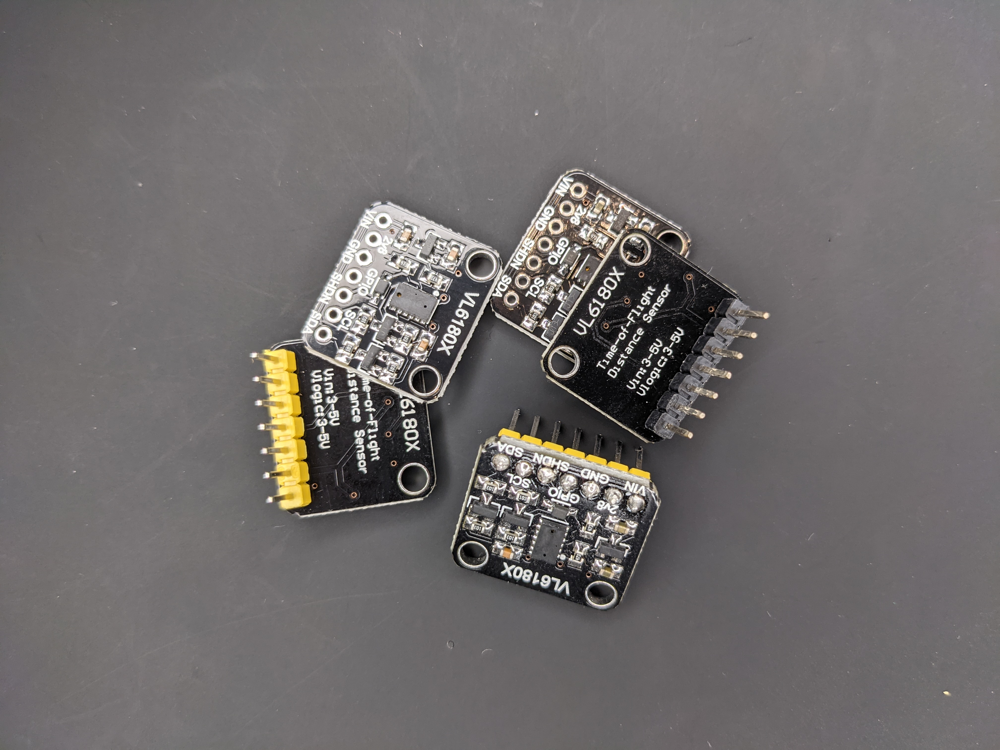

Besides measuring range (0-~20 cm), it can measure ambient light and recognize gestures, but I will
only measure range.

For more information, have a look at [ST's documentation](https://www.st.com/en/imaging-and-photonics-solutions/vl6180x.html)

I picked this sensor for my project because it's tiny, cheap, and performant. It's a big step up
from the bulkier range sensors you typically see in hobbyist projects like the Sharp
series (e.g. GP2Y0A21YK0F) or the HC-SR04.

## Where to get the VL6180X?
The VL6180X is available in a reflowable package, but the easiest way to test it is to
get a breakout board. The breakout boards I've seen have the same pinout and go for about
$5-15.

## VL6180X pinout
The typical VL6180X breakout board provides you with 7 pins:

| Pin | Description/Usage |
| --- | ----------------- |
| VIN | 5V or 3.3V (but check your breakout board to make sure)  |
| 2v8 | Just 2.8V, can normally be left unconnected |
| XSHUT | Used for putting the sensor in reset (needed for setting addr in multi-sensor) otherwise leave unconnected |
| GPIO | Used for receiving interrupt (can leave unconnected if polling) |
| GND | Ground |
| SDA | I2C data line |
| SCL | I2C clock line |

That's a lot of pins, which is something to consider if you need to use several VL6180Xs because you may need
to get a microcontroller package with a larger pin count or add a GPIO expander.

## MSP430
I will write the code for an MSP430G2553 using the [MSP430 LaunchPad](https://www.ti.com/tool/MSP-EXP430G2).
If you are new to embedded systems, the MSP430 is a great starting point because it has good tooling and
documentation and a good set of peripherals.
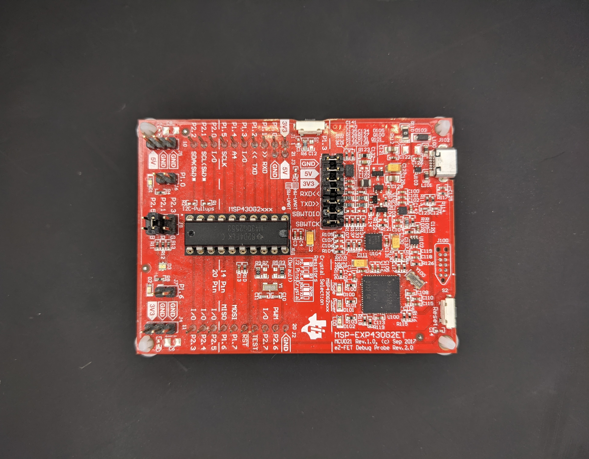

## How to hook up the VL6180X?
The bare-minimum you must connect to talk with a single VL53L0X are the power pins (VIN and GND) and the
I2C pins (SDA and SCL). When we implement multi-sensor support in a [later section](#using-multiple-vl6180x-on-the-same-i2c-bus), we also need to connect
the XSHUT pin. We are only polling, so we can leave the GPIO (interrupt pin) unconnected.

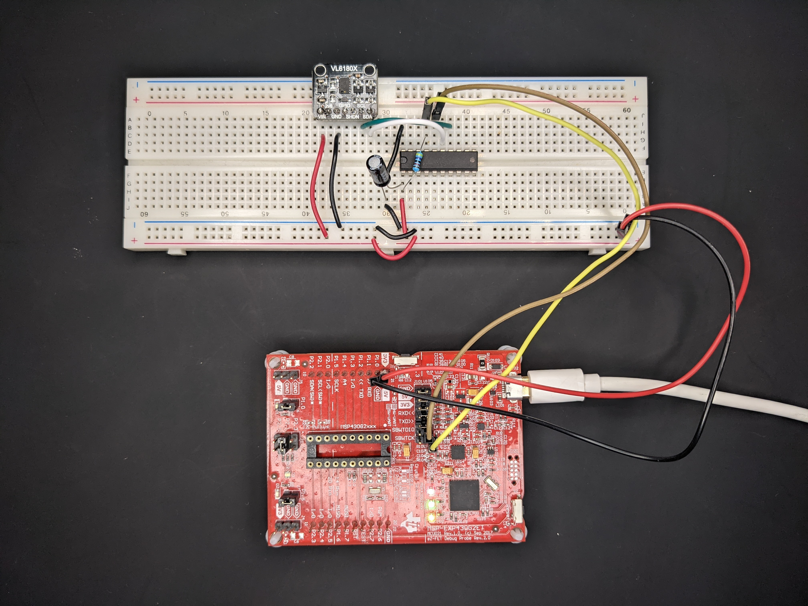

**NOTE:** _I often move the MSP430 DIP package from the launchpad to a solderless board for easier prototyping and
only use the launchpad for programming. If you do the same, make sure you add a 47 kOhm pull-up resistor on the reset line
to prevent the MCU from endless reset. You should also add a bypass capacitor near the VCC pin to avoid voltage
drop. Otherwise you are likely to experience intermittent reboots because of the current surges from the VL6180X._

## I2C pull-up resistors
A critical aspect of I2C is that it's designed to have the bus operate in open-drain, which means the I2C devices can
only drive the bus lines low or not at all. They can't drive them high. Therefore, we need a mechanism to pull
the lines high by default, and this is where the _pull-up resistors_ come in. These resistors are connected
between the I2C lines (SDA and SCL) and the VCC line (e.g. 3.3 V). If there are no pull-up resistors, there is no default logic level, so **the I2C communication will simply not work**.

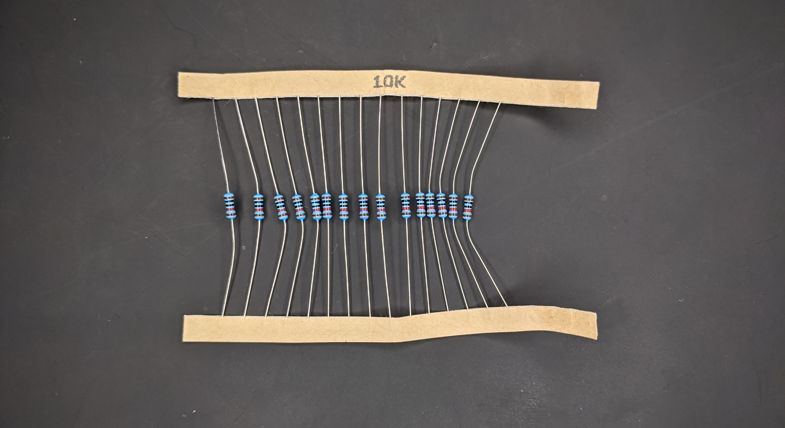

## What value should the pull-up resistors have?
Okay, so we need pull-up resistors, but what value should they have?

A too low value will make the pull-up too strong, preventing the I2C devices from pulling the lines low, which is why you can't connect the bus lines directly to VCC. It will also waste a lot of power.

A too-large value will make the pull-up too weak, making the lines go back to high state slower, limiting the communication speed. This is also why you typically don't use the internal pull-up (~100 kOhm) resistors of the microcontroller.

The optimal value depends on your setup, particularly the wire properties (bus capacitance) and
the communication speed (rise time) you desire. I won't go into these details here. As a general rule
of thumb, 4.7-10k typically works well.

**NOTE:** _Your breakout board will likely already have a pair of pull-ups - my VL6180X breakout board has
10k pull-ups. In that case, you don't need to think about it, but be cautious about connecting several breakout
boards to the same I2C bus because then the effective pull-up resistance can become too low._

## Essential tools for debugging I2C
First, if you work with a protocol such as I2C, SPI, or UART, **you need a logic analyzer**.
If you don't have one, get one. It's going to save you so much debugging time. Fair, you may not want to
spend several hundred bucks on something like a Saleae, but at the very least get a cheap FX2-based
analyzer (< 20 USD) and use it with [sigrok](https://sigrok.org).

Second, **get an Arduino**. Even if we are not coding for an Arduino, it's useful for verifying
that your sensor works. There are good Arduino libraries that take 5 minutes to set up. Combined
with a logic analyzer, it also gives you a reference on what I2C traffic to expect, which will save
you plenty of time when writing your driver.

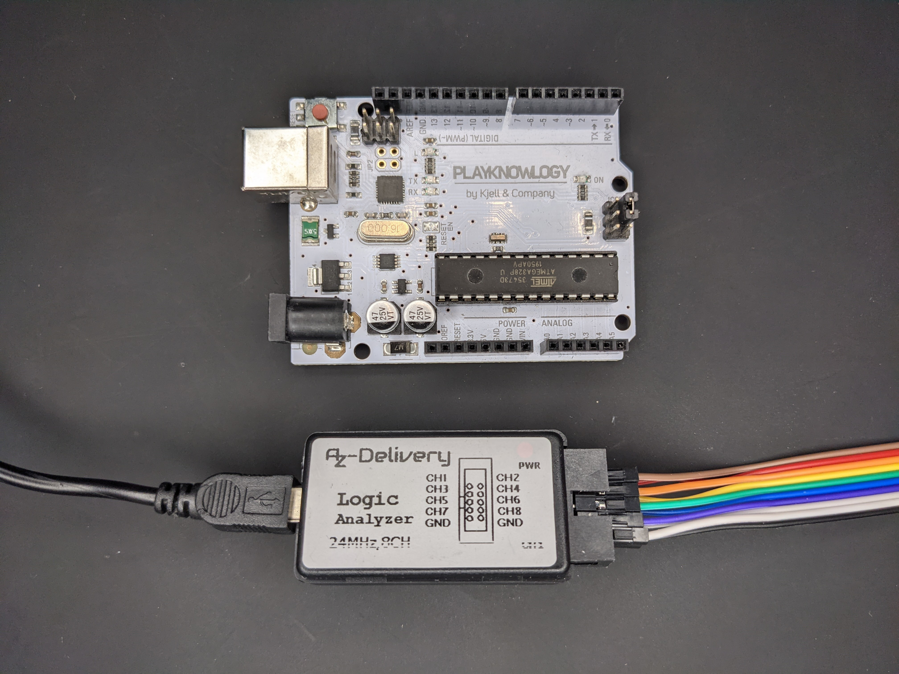

# My approach

I will code in a bottom-up approach, starting with the I2C layer at the bottom and then
move up to the VL6180X driver. The code will be polling-based (not interrupt-driven) and
have no sophisticated error handling or recovery. I have done this to simplify the code, but
I do discuss these topics in [another section](#improvements-you-can-make).

**NOTE:** _If you stumble upon issues when implementing this yourself, have a look at
[Common issues](#common-issues)._

# The code
All of the code is available at [GitHub](https://github.com/artfulbytes/vl6180x_vl53l0x_msp430),
and I also share parts of it as gists in this post. The easiest way to follow along is to pull
down the repo from GitHub and then use interactive git rebase (_git rebase -i --root_) because
I have basically made a new commit after each section.

# Initialize the microcontroller
We have everything set up and the tools we need; It's time to start coding.

Starting from scratch, the first thing you need to do is create a new project in your editor
of choice. I prefer to use Code Composer Studio and GCC for MSP430 development.

As with most microcontrollers, there is some initialization we must first do. On the MSP430,
we at least need to configure the watchdog timer and the clock speed. The MSP430 goes up
to 16 MHz, but configuring it for 1 MHz is enough here.

<Gist id="422ae5ce3f27cdc75759ff6e4fa7986a" />

If you are unsure about any of this, take a look in your microcontroller's datasheet or user's guide. [Here](https://www.ti.com/lit/ug/slau144j/slau144j.pdf?ts=1597666718965&ref_url=https%253A%252F%252Fwww.ti.com%252Fproduct%252FMSP430G2553) is the one for MSP430.

# I2C driver
Let's create two new files for the I2C driver _drivers/i2c.h_ and _drivers/i2c.c_.

**NOTE:** _I like to keep my low-level drivers under a separate folder drivers/ and have a separate
header and implementation file for each driver._

## Initialize I2C on MSP430
To use I2C, we must configure the pinout and I2C peripheral of the microcontroller. The GPIOs on
a microcontroller can serve several functions, so we have to select the function explicitly.

The MSP430G2553 has 16 GPIO pins, and only pin 1.6 (SCL) and 1.7 (SDA) can be selected for I2C.
We select I2C by writing to the select-register.

<Gist id="bbee65b5e2db933ca2ca691680aa6d1c" />

Next, we have to configure the I2C peripheral. On the MSP430, we do this by configuring the
USCI module, which is a general module for I2C, SPI, and UART communication. In particular,
we need to write to these registers:

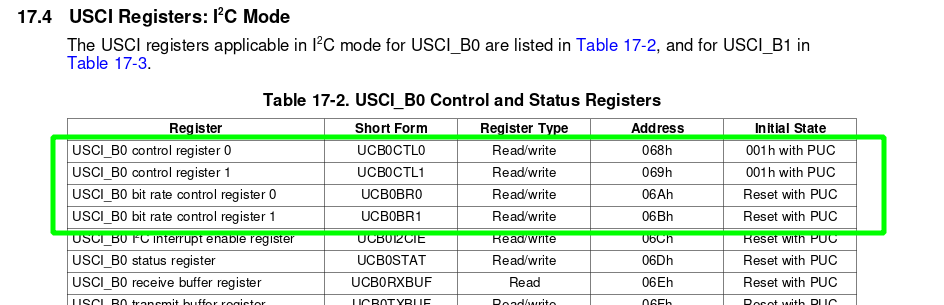

They are explained further in section 17.4 in [MSP430 user's guide](https://www.ti.com/lit/ug/slau144j/slau144j.pdf).

To configure I2C on the MSP430, you have to:
1. Put USCI module in reset
    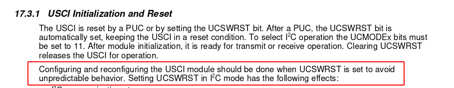
2. Select I2C, set synchronous single-master mode
    - The VL6180X is a slave device, and we act as master
    - I2C supports multiple masters, but we are a single master here
    - USCI supports asynchronous mode for UART/USART, but I2C is a synchronous protocol
3. Set the I2C clock rate
    - I2C supports different clock rates (e.g. standard and fast mode)
    - VL6180X can be configured for different rates
    - I will use 100 kHz (Standard mode) here
    - Note, if you configure a higher clock rate, you may need to adjust the pull-up resistors
4. Bring USCI out of reset
5. Set slave address
    - With I2C, the master always begins each communication by sending the address of the slave
    - The bus may have multiple slaves, and only the slave with the address should respond
    - The default address of VL6180X is 0x29

Writing this as a function we get:

<Gist id="e89a23c2cb542804fac52c719f59b0f5" />

## Send a single byte to the slave
After initializing I2C, a good first step is to send a single byte from the master to confirm
that our setup works.

I2C is master-driven, so the master is always the one initiating the communication. It
sends a start condition followed by a byte containing the 7-bit slave address
and a single R/W bit to indicate the transmit mode (RX/TX). Once a slave acks this byte,
the master continues with sending the actual data.

To send a byte from the MSP430, we must
1. Configure TX mode and enable the start condition bit
2. Fill the transmit buffer with the byte we want to send
3. Wait for the start condition to be sent
4. Check if the slave acknowledged the address+start condition
5. If the slave acknowledged it, wait for the byte to be sent
6. Check if the slave acknowledged the byte
5. Send a stop condition to end the communication

**NOTE:** _You MUST fill the transmit buffer before waiting for the start condition
(and address) to be sent because the start condition won't be sent otherwise, which is easy
to miss if you don't read the datasheet carefully._

The code:

<Gist id="9f62507ebdf29709bc14cff3ef7d9fac" />

**NOTE:** _I only return false to indicate failure, which is naive. For example, if the slave
hogs the bus for some reason, we may wait indefinitely for the start condition
to be sent. I'm doing this to simplify the code. I discuss error handling more in a [later
section](#errors)._

We can call it from the main function in a loop and
set a breakpoint with our debugger to verify that it works. Now is also a good time to pick up your logic
analyzer.

For example, writing the value 9 repeatedly:

<Gist id="d8447cd38b652c76f75731066f7b5e66" />

This is what you should see **without** the VL6180X connected:

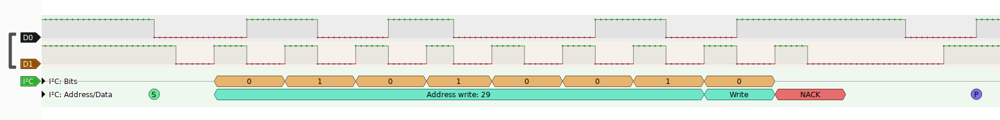

This is what you should see **with** the VL6180X connected:

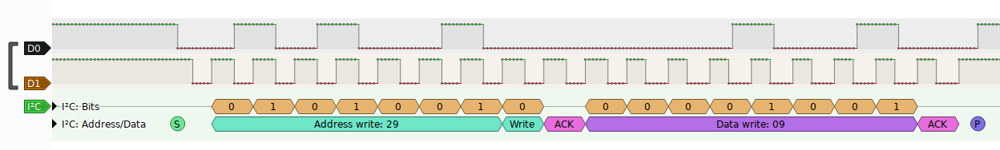

You can also verify the clock rate:

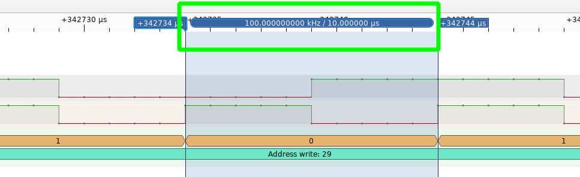

**NOTE:** _If you have any issues at this point, please take a look at the section [Common issues](#common-issues)._

## Receive a single byte from the slave
To read a byte from the slave, we follow a similar flow:

1. Configure RX mode and enable the start condition bit
2. Wait for the start condition to be sent
3. Check if the slave acknowledged the address+start condition
4. If the slave acknowledged it, send the stop condition immediately
5. Wait for the byte from the slave
6. Read the byte from the RX buffer

Also, when we want to receive a single byte, we should send the stop condition
immediately after the start condition according to the [MSP430 user's guide](https://www.ti.com/lit/ug/slau144j/slau144j.pdf) section 17.3.4.2.2:

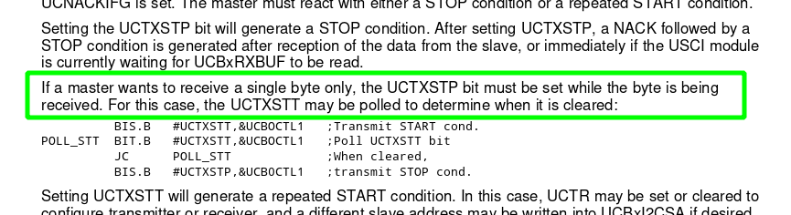

**NOTE:** _In practice, the master never tries to receive a byte before first transmitting something
to the slave. It doesn't make sense to read a byte out of the blue because how can the slave
know what the master wants if the master doesn't tell it first? Anyway, I do it here only
as a demonstration._

The code:

<Gist id="c17da49629bc74e2d958d35633d2cd2c" />

I return the received byte via the function argument because I still want to use the return
value to indicate success or failure.

If we call the read function similar to how we called the write function, the logic analyzer should
show the following:

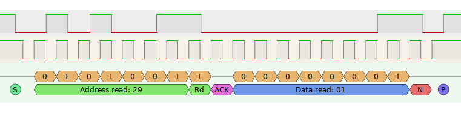

The slave (VL6180X) ACKs our start condition, but the read byte is NAKed. If you run the read function
several times, you will also notice that the value differs each time, which we expect, because as
I said the slave doesn't know what we want to read.

## Read a register via I2C
The read function is useless on its own, so let's combine it with the write function to
create a useful function that reads a register on the VL6180X. To read a register, we basically
have to run the write and read function back-to-back:

1. Configure master for transmitting bytes (similar to the write function)
2. Transmit the address of the register we want to read
3. Reconfigure the master for reading bytes (similar to the read function)
4. Read the byte (register value)

In step 2, however, we have to write two bytes because the register addresses of VL6180X are
16-bit wide. Moreover, VL6180X expects us to write the most significant byte (MSB) first. All of
this is explained in [VL6180X's datasheet](https://www.st.com/resource/en/datasheet/vl6180x.pdf).

The code:

<Gist id="c3284caa89294c97e9f2e49d4532375a" />

Most of the code is identical to the write and read function we previously created. The
main difference is that we send two bytes (dividing the 16-bit address with bitwise
operations). We also don't send a stop condition after the write, but instead, we send
a so called _repeated_ start condition.

To verify the read register function, we can read the register with address 0x00. This register
contains the device id of VL6180X, which is always 180 (0xB4). Once again, they explain this in the datasheet.

Putting the logic analyzer to work, you should see the following traffic:

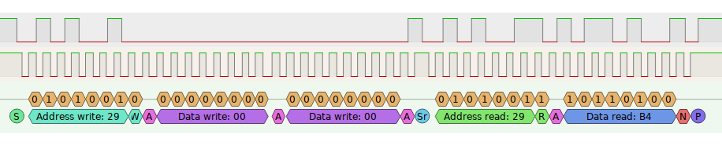

As you can see, the master writes the address (0x00+0x00=0x0000), then sends a
repeating start condition, and finally reads the byte (0xB4). You may be surprised
to see that the last byte is NAKed even though we receive the correct value, but this
is entirely according to I2C specification:

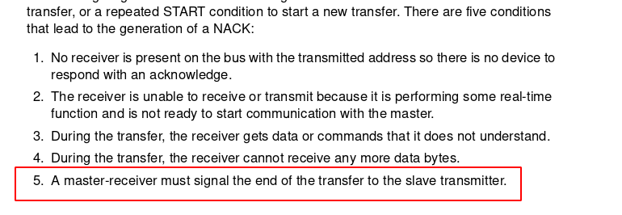

The master sends a NAK to signal the slave it has finished reading.

We can also verify we get 0xB4 (180) with the debugger in CCSTUDIO

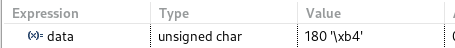

Great, now we got something useful.

## Write to a register via I2C
Similarly, we should create a function to write to a register on the VL6180X, which is easier than reading a byte because we can keep the master in transceiver mode.

<Gist id="9b698d1b6f09491541eb449522010714" />

**NOTE:** _I name the I2C functions according to the address and data size. I prefer separate
functions over having extra arguments because I think it makes the code cleaner. I add support for
more sizes in the next section._

The best way to confirm that it works is to first write to some register and then read from the
same register. According to the datasheet, the register with address 0x10A is an 8-bit register
with a valid range of 0-255. Let's write a 13 to this register and see if we get the same
value back:

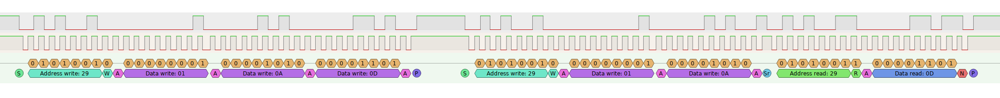

Look at [this commit](https://github.com/artfulbytes/vl6180x_vl53l0x_msp430/tree/c2bb15bfd25a27002ebc94fcdb00e763812df903) for
the complete code until this point.

## Support 8/16/32-bit address and data sizes
Being able to read and write a single byte is not enough to fully communicate with the VL6180X.
We also need to read and write 16-bit and 32-bit data registers. Besides, it's a
good idea to make the I2C layer flexible so we can re-use it for different devices (e.g.
the VL53L0X is 8-bit addressed).

This is mostly a matter of refactoring the existing functions, adding extra helper functions,
and introducing some nice constructs to make the code cleaner.

The new _drivers/i2c.h_:

<Gist id="3f2feefc4ab0ca12604c3292a38f7bfe" file="i2c.h" />

The new _drivers/i2c.c_:

<Gist id="3f2feefc4ab0ca12604c3292a38f7bfe" file="i2c.c" />

I won't explain the code line-by-line as it's mostly self-explanatory, but there are
some good practices the code exemplifies:

* [Make helper functions _static_ to limit their scope](https://embeddedgurus.com/stack-overflow/2008/12/efficient-c-tips-5-make-local-functions-static/)
* [Typedef structs and enums](https://stackoverflow.com/questions/252780/why-should-we-typedef-a-struct-so-often-in-c)
* [Use portable type definitions (i.e. uint8_t, uint16_t, etc.)](https://electronics.stackexchange.com/questions/145017/for-embedded-code-why-should-i-use-uint-t-types-instead-of-unsigned-int)
* [Use void for function declarations without arguments](https://stackoverflow.com/questions/693788/is-it-better-to-use-c-void-arguments-void-foovoid-or-not-void-foo)

After refactoring, don't forget to sanity-check that everything works by writing to and
reading from a register again.

**NOTE:** _I didn't implement all the address and data sizes combinations, but the missing
ones are easy to implement if you need them._

**NOTE:** _I added two functions for reading and writing an array of bytes in preparation for the
VL53L0X driver in my other blog post_

Look at [this commit](https://github.com/artfulbytes/vl6180x_vl53l0x_msp430/tree/69ccf734da42058b770b031fa851a285fbc9ba7f) for
the complete code until this point.

# Writing the driver for VL6180X
Now that we have the I2C driver in place for our microcontroller, we are ready to move
one layer up to write the driver for the I2C device. While the I2C device driver is
tied to the microcontroller, the driver for the I2C device sits one level above and
should ideally be independent of it. Doing it like this makes it easy to re-use the I2C driver for
another device (which I do in my [VL53L0X blog post](vl53l0x-post)) and to port the VL6180X driver
to another microcontroller.

The VL6180X has a lot of functionality (and registers) to explore ([VL53L0X is even worse](vl53l0x-post)).
I won't go through it all, instead, I will focus on initialization and basic range measuring,
which gives you a good starting point to explore the VL6180X further.

ST provides a "portable" [API driver](https://www.st.com/en/embedded-software/stsw-img003.html) for
the VL6180X, so technically, you don't need to write your driver. You only need to implement the lower-level I2C functions that are specific to your microcontroller. Though I find their code
overly abstracted and challenging to read, and if you pull it in as is, you will end up with a lot of
code you don't use.

I prefer to write my own driver (whenever it's practical) to keep the memory footprint
small and simplify debugging. Still, it was great to use ST's API driver (and the Arduino libraries from Adafruit and Pololu) as a reference
point.

## How to initialize VL6180X
Similar to the I2C driver, create two new files under _drivers/_: _drivers/vl6180x.c_
and _drivers/vl6180x.h_.

There are several steps to initializing the VL6180X. They are described in
the [appnote AN4545](https://www.st.com/resource/en/application_note/an4545-vl6180x-basic-ranging-application-note-stmicroelectronics.pdf):

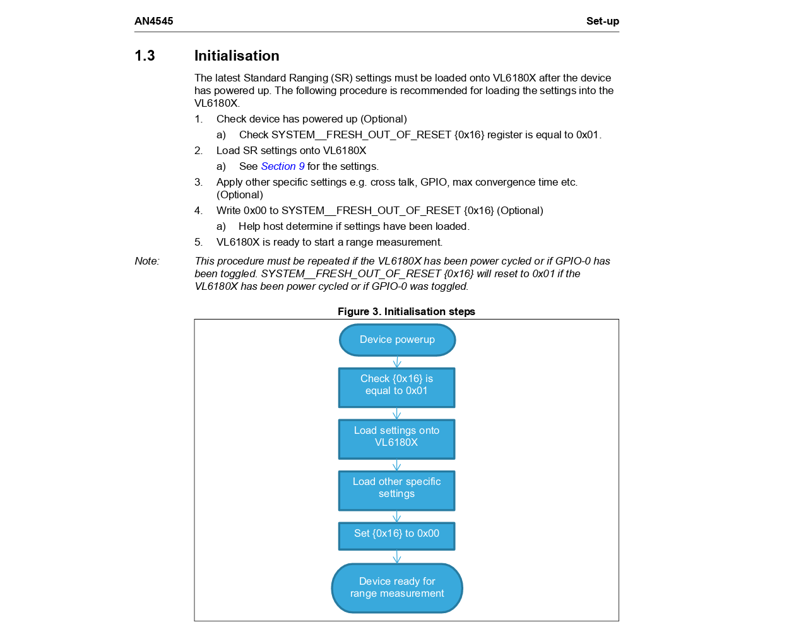

Writing out the code, we get:

<Gist id="f09c35c8d12012ed838437de090c4fa5" />

I've added some defines at the top for the register addresses to make them easier to track. I also follow the good practice of
[enclosing the values with braces](https://stackoverflow.com/questions/9081479/is-there-a-good-reason-for-always-enclosing-a-define-in-parentheses-in-c).
You can find the complete register map in the datasheet.

The first thing we should do is ensure the device is freshly booted, or well, this is optional,
but it's a good sanity check. Besides, we have to wait at least 1 ms for the device to be ready anyway.
The datasheet also says that we should wait for 400 us after GPOI0 (XSHUT) pin goes high.
On the breakout boards, the XSHUT pin is pulled high by default, so it's pulled immediately after
power-up, and unless your microcontroller is super fast, you will already have spent 400 us before
getting to this point.

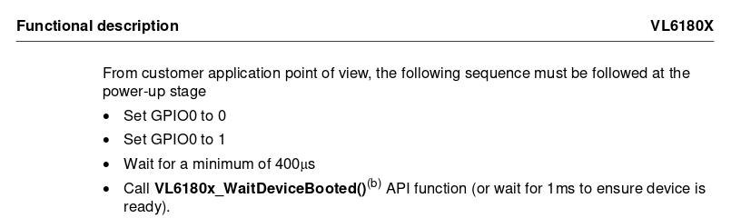

We can wait for the VL6180X to boot by loop-reading the "fresh out of reset" register.
**NOTE:** _As it's written, the wait_device_booted() will hang if VL6180X is not
freshly booted. Consider adding a timeout._

Once the device is booted, we should set some recommended standard ranging (SR) settings according to AN4545. To make the code less verbose, I _AND_ (&) the values and
only check the total return value in the end. See _write_standard_ranging_settings()_.

There are also some other recommended registers we should set (see _configure_default()_).

Once we are done with the configuration, we are no longer fresh out of reset, so we clear the
"fresh out of reset" register.

## How to measure distance with VL6180X
At this point, the sensor is initialized and ready for range measurement.
The application note also explains the range measuring flow:

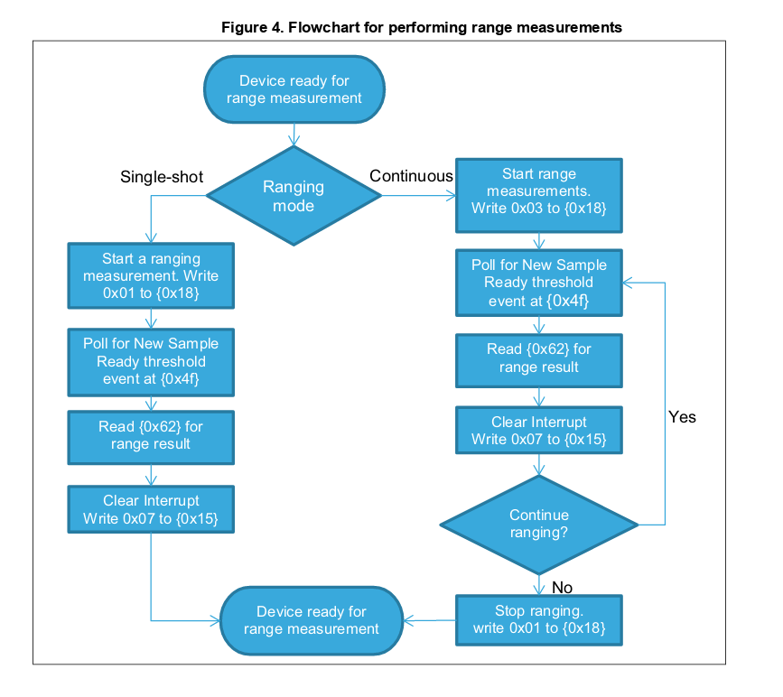

There are two modes, _single_ and _continuous_. In _single-shot mode_, we have to start
the measurement each time, while in _continuos mode_, we can set up the sensor to measure
at a given interval. I will only implement _single-shot mode_.

<Gist id="3745171161179ae117b075b1fba8d632" />

I continue with polling (instead of interrupt-driven) for simplicity. I talk about
interrupts in [another section](interrupts).

We can put a breakpoint with our debugger (or use our logic analyzer) to inspect the
received value to confirm that we get a good measurement.

<Gist id="29eaa1e1a549437b879bec0ab0575774" />

For example, holding my hand close to the sensor:

Holding my hand further away:

No hand:

VL6180X reports 0xFF (255) when no obstacle is detected.

Look at [this commit](https://github.com/artfulbytes/vl6180x_vl53l0x_msp430/tree/70e6994f564b363bb73ef341d56b4a7a4263364d) for
the complete code until this point.

# Multiple VL6180X on the same I2C bus
We got a single VL6180X working, but what if we want to use multiple ones on the
same bus?

A big advantage with I2C is that additional slaves don't require extra pins (in contrast
to other protocols like SPI). For this to work, each slave must have a unique address, but
as we saw, the VL6180X always has a default address of 0x29, which means there will be a bus
collision if we hook up several of them.

Fortunately, the address of VL6180X is configurable, but unfortunately, configuring it
requires I2C communication. We can get around this catch-22 situation by using the
GPIO0 (XSHUT) pin. The VL6180X won't respond to I2C when we pull the XSHUT pin low, and in turn, we can put all our VL6180X in standby and then bring them up and configure them one by one. This approach is explained in this [appnote](https://www.st.com/resource/en/application_note/an4478-using-multiple-vl6180xs-in-a-single-design-stmicroelectronics.pdf).

For example, with three sensors:

1. Put S1, S2, S3 in standby
2. Wake S1 and give it a unique address
3. Wake S2 and give it a unique address
4. Wake S3 and give it a unique address

The downside, of course, is that we then lose the "few pins"-advantage of I2C because
we have to connect the XSHUT pin for each VL6180X.

## How to connect multiple VL6180X
Connect the additional sensors to the same lines as with the first sensor (VCC, GND, SDA, and SCL),
and then connect the XSHUT pins to some GPIO pins of your microcontroller.

I will use three sensors for demonstration and connect their XSHUT to
pin P1.0, P1.1, and P1.2 on my MSP430.

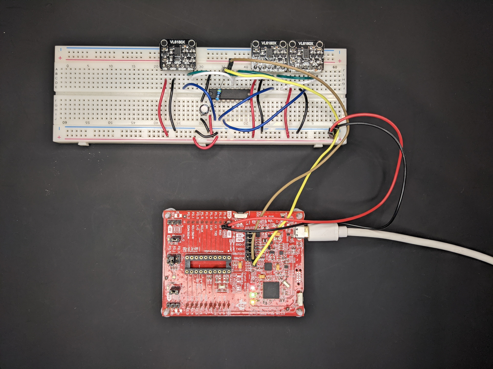

**NOTE:** _When you connect multiple breakout boards that have pull-up resistors, the total pull-up
resistance will decrease. In my case, the breakout boards have 10 kOhm resistors, which means
the effective resistance becomes 10/3 ~= 3.3 kOhm. This still works for me, but it's a problem
to be aware of._

## Extending the driver to support multiple VL6180X
Let's extend the existing functions and add a bunch of helper functions to support multiple
VL6180X.

The new _drivers/vl6180x.h_:

<Gist id="938a8995f558591fc89d0d1a61913f91" file="vl6180x.h" />

The new _drivers/vl6180x.c_:

<Gist id="938a8995f558591fc89d0d1a61913f91" file="vl6180x.c" />

I also added a separate GPIO handling layer to hide the microcontroller specifics from the
sensor driver:

_drivers/gpio.h_:

<Gist id="2e3157a611804f4ac0f03b85925813d1" file="gpio.h" />

_drivers/gpio.c_:

<Gist id="2e3157a611804f4ac0f03b85925813d1" file="gpio.c" />

I added an enum to index the sensors, which makes it easy to add more sensors. The enum
values are pretty ambiguous, so you may want to rename them to something more useful.

I also like to use an array with _designated initializers_ to map the enum values to the data
struct of each sensor.

I'm using addresses 0x30, 0x31, and 0x32 for no particular reason. You should be fine as long
as the address is unique and 7-bit long.

As I mentioned earlier, the datasheet says that we have to wait for 400 us after pulling the
XSHUT pin high. I use the _delay_cycles_ function for this, which translates to a busy loop.
I know we should avoid busy looping, but it's only for a short moment in this case. If you
are using another microcontroller, you need to find some alternative function.

Once the addresses are configured, we do the same initialization steps as before
for each sensor.

You can verify that it works by calling _vl6180x_read_range_single_ for each sensor and inspect
the value with the debugger or logic analyzer.

Look at [this commit](https://github.com/artfulbytes/vl6180x_vl53l0x_msp430/tree/ed8fda152c1c669c6bf504be8d6b4f12da79ca82) for
the complete code until this point.

# Improvements you can make
The code I've given you is simple, and there are many improvements you can make to it.
I will mention the most obvious ones in this section.

## Interrupts
One improvement to consider is to use interrupts instead of polling. Polling can
be pretty wasteful because you let the CPU run while not doing anything useful.
With interrupts, the MCU can do other things while waiting or sleep to reduce
power consumption.

But remember, polling is not always a bad idea; it depends on your application. It may be unnecessary to add the extra layer of complexity of interrupts. For example,
in my sumobot project, I mostly do polling because I can't really do anything useful
while waiting for the data from my sensors, and the power consumption from the MSP430
is negligible in the scheme of things.

Even if the end goal is to use interrupts, it's often easier to get polling to work
first.

You may also consider doing both. For example, if you have multiple sensors,
you could start range measure for all of them but only wait for an interrupt
from one of them and poll the rest. This reduces the amount of polling and
saves you some interrupt pins.

## Errors
I have barely considered error handling in the code examples above. In practice,
many things can go wrong with I2C.

As a start, you could return different error codes depending on the error instead
of a binary true or false. Together with some tracing to a console, this could make
your debugging life easier.

You could also add a timeout at places where you risk getting stuck in
an endless loop, for example, where we wait for the start condition to be sent, which can hang if the slave hogs the bus for some reason.

Taking it one step further, you should consider how to handle the errors. You
may want to retry, ignore the failing device, or try to [recover from the error](https://www.pebblebay.com/i2c-lock-up-prevention-and-recovery/).

As with most, how far you take depends on your application. If your system is critical and must work all the time, you have to think carefully about it. If not, then your efforts are better spent elsewhere.

I try to avoid adding too much error handling or recovery during development
and instead let things go wild when errors occur because it makes it easier to spot them.
Your aim should always be to track down and fix your issues instead of band-aiding them
with error handling.

Error handling is a big topic, and there are many resources to find on the internet. I suggest you look at them and study the open-source libraries out there for some practical examples.

## DMA
Since direct memory acccess (DMA) is a common technique used when transferring data, it's
natural to consider it for I2C. In practice, however, DMA is rarely used for I2C because
the protocol is slow and most of its transactions are small (as exemplified here),
making DMA cost more than it saves. Moreover, many DMA controllers don't fully support
the I2C protocol, forcing you to baby sit the transactions, which in turn defeats the
purpose of DMA: off-loading the CPU. [Here is a take on I2C by an MSP430 expert](https://e2e.ti.com/support/microcontrollers/msp-low-power-microcontrollers-group/msp430/f/msp-low-power-microcontroller-forum/191583/do-msp430-dma-channels-support-i2c-interface---data-transfer).

## Explore VL6180X further
There is more you can do with the VL6180X than I've shown here.

You can reconfigure it to better match your example. For example, you measure a longer
range if you are okay with lower resolution and accuracy. You can use the continuous mode
instead of the single-shot mode. You may also be interested in using it for gesture recognition
or measuring ambient light (ALS).

Have a look at [ST's documentation](https://www.st.com/en/imaging-and-photonics-solutions/vl6180x.html) for more information.

# Common issues
In this section, I list a few issues you may encounter.

**"The I2C code get stuck"**

This typically means the slave is in a bad state, which can happen when you reflash
your microcontroller and interrupt the I2C transaction mid-through. If you are unlucky,
you interrupt during a read transaction, which causes the slave to hog the data line when
the master is back up again. The solution is to reflash the MCU, put a breakpoint at the
start, and reset the power (pull power pin) of the slave device before continuing. Alternatively,
you can cut the power entirely of the MCU and sensor.

**"I2C stuck on transmitting the start condition"**

Another reason for getting stuck at the start condition (on the MSP430) is if you forgot
to write to the TX buffer. When the master is in TX mode, you must write to the TX buffer
before waiting on the start condition.

**"VL6180X is not responding"**

Triple-check that all lines are connected properly, especially if you are breadboarding.
Check that you haven't mixed up SDA and SCL, and measure the power lines with a multi-meter.
You can rule out that the unit is faulty by using an Arduino. Also, inspect the I2C traffic
with a logic analyzer and read the I2C specification, so you know what to expect.

**"My microcontroller reboots during range measurement"**

The sensor can draw surges of current when operating. Make sure you use a bypass capacitor
for the VCC pin of your microcontroller.

# General tips
And some general driver development advice.

**Read the datasheet**

A golden rule in embedded systems development is "read the datasheet". You often overlook
several things the first time you skim the datasheet and find the answer the second
time around.

**Isolate then integrate**

Implement your driver in isolation (before you integrate it into your project) to reduce
interference from other parts of your code.

**Get it working first**

It's easier to extend something that works than implementing everything at once. Just look
at how we implemented the code in this post. We began by writing and reading a single byte,
then writing and reading a register, and so on. Always try to implement in increments, from
simple to complex.

# Recommended reading
There are many good resources on I2C, VL6180X, and MSP430. Under this section, I will recommend
the ones I found helpful.

The documentation for VL6180X is to be found on [TI's official site](https://www.st.com/en/imaging-and-photonics-solutions/vl6180x.html) for it. The most useful
documents are the [VL6180X datasheet](https://www.st.com/resource/en/datasheet/vl6180x.pdf) and the [application note AN4545](https://www.st.com/resource/en/application_note/an4545-vl6180x-basic-ranging-application-note-stmicroelectronics.pdf).

General I2C docs:
* [I2C specification](https://www.nxp.com/docs/en/user-guide/UM10204.pdf)
* [A website solely dedicated to I2C](https://www.i2c-bus.org/)
* [Application report from TI explaining I2C](https://www.ti.com/lit/an/slva704/slva704.pdf?ts=1623958137626&ref_url=https%253A%252F%252Fwww.google.se%252F)

MSP430 resources:
* [The user's guide](https://www.ti.com/lit/ug/slau144j/slau144j.pdf)
* [MSP430 Microcontroller Basics by John H. Davies](https://www.sciencedirect.com/book/9780750682763/msp430-microcontroller-basics)
* [A lenghty blog post explaining I2C for MSP430](http://www.simplyembedded.org/tutorials/msp430-i2c-basics/)
* [Application report on common MSP430 I2C issues](https://www.ti.com/lit/an/slaa734a/slaa734a.pdf?ts=1621856482181)
* [The MSP430 forum](https://e2e.ti.com/support/microcontrollers/msp-low-power-microcontrollers-group/msp430/f/msp-low-power-microcontroller-forum)

Useful threads on the MSP430 forum:
* [I2C hangs up on while (!(IFG2 & UCB0TXIFG));](https://e2e.ti.com/support/microcontrollers/msp-low-power-microcontrollers-group/msp430/f/msp-low-power-microcontroller-forum/142211/i2c-hangs-up-on-while-ifg2-ucb0txifg)
* [I2C hangs on while(UCB1CTL1 & UCTXSTT);](https://e2e.ti.com/support/microcontrollers/msp-low-power-microcontrollers-group/msp430/f/msp-low-power-microcontroller-forum/142810/i2c-hangs-on-while-ucb1ctl1-uctxstt)
* [What could cause an I2C transaction to fail to start...](https://e2e.ti.com/support/microcontrollers/msp-low-power-microcontrollers-group/msp430/f/msp-low-power-microcontroller-forum/91826/what-could-cause-an-i2c-transaction-to-fail-to-start-after-i-ve-set-uctxstt)
* [MSP430 hangs while checking uctxstt bit](https://e2e.ti.com/support/microcontrollers/msp-low-power-microcontrollers-group/msp430/f/msp-low-power-microcontroller-forum/865936/msp430f5340-msp430f5340-hangs-while-checking-uctxstt-bit)
* [I2C master reads one byte more than needed](https://e2e.ti.com/support/microcontrollers/msp-low-power-microcontrollers-group/msp430/f/msp-low-power-microcontroller-forum/587755/msp430f5659-i2c-master-reads-one-byte-more-than-needed)

Useful posts on I2C error handling:
* [Appnote on how to recover from I2C bus hang](https://www.analog.com/media/en/technical-documentation/application-notes/54305147357414AN686_0.pdf)
* [Stack overflow post about I2C bus hangs](https://electronics.stackexchange.com/questions/350173/what-are-the-various-ways-in-which-an-i2c-bus-may-hang)
* [A great article on I2C error recovery](https://www.pebblebay.com/i2c-lock-up-prevention-and-recovery/)
* [Forum post, how to recover from I2C bus lockup](https://www.microchip.com/forums/m175368.aspx)

Code to study:
* [The API driver by ST](https://www.st.com/en/embedded-software/stsw-img003.html)
* [Arduino library by Pololu](https://github.com/pololu/vl6180x-arduino)
* [Arduino library by Adafruit](https://github.com/adafruit/Adafruit_VL6180X).
* [Open-source I2C library with MSP430 support](https://github.com/jrowberg/i2cdevlib)

# Closing words
I2C is a widely used protocol and one to be familiar with as an embedded systems
engineer. Like any other communication protocol, a good way to learn it is to
implement a driver.

We wrote a driver for the VL6180X, a range sensor with an I2C interface.
With MSP430 as the microcontroller, we wrote the driver in two layers, first the general I2C layer and then the VL6180X layer. This demonstrates a common pattern in embedded systems development where you layer the drivers to make them more reusable and portable.

VL6180X is an interesting range sensor because of its size and price, and decent documentation. For some applications, the range of
< 20 cm will be far too small, and in that case, you want to look at its
big brother VL53L0X, which I cover in [my next blog post](vl53l0x-post).

Once again, all of the code is available at [GitHub](https://github.com/artfulbytes/vl6180x_vl53l0x_msp430).
