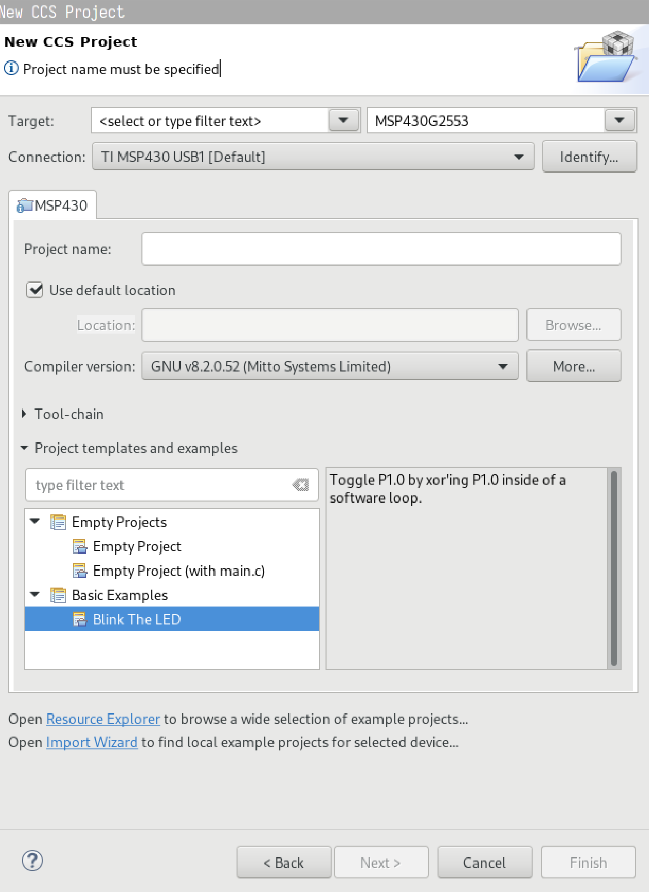

import Gist from "react-gist"

In this post, we will create a _Makefile_ from scratch for a microcontroller
project. Since a _Makefile_ is basically a way to improve your command line workflow,
I divided this post into two parts: first, we develop a command to
build an example project without Make, and then we gradually develop a
_Makefile_ to build the same project with Make.

You find the Makefile and example project in [this repository](https://github.com/artfulbytes/makefile_microcontroller).

# Make vs IDE
If you are new to Make, you may wonder why you would want to use it over an
IDE that seemingly already does it all: edit, build, flash and debug.

Why would we want to complicate things with a _Makefile_?

A major reason for using a _Makefile_ is that it gives us more control over the build process, which becomes more important
as we grow into larger projects and start relying on code written by others.

Having more control of the build process also forces us to better understand
it, which is crucial because when we work with C/C++ and embedded systems we
inevitably run into build issues.

A third reason is that it frees us from having to work in a specific IDE.
Many people, including me, prefer to work from the command line together with an editor like
Vim or Emacs. We prefer to optimize a single workflow instead of having to "start
over" with a new environment each time our target changes.

# My setup (microcontroller and OS)
I will target the microcontroller MSP430G2553, so there will be some MCU specifics, but it should be easy to modify this Makefile for any other microcontroller. Moreover, I will
be doing all of this on a Linux machine, and while you can use Make on Windows, Linux is
much better for working on the command line.

**NOTE:** _If you have a project you need to build on multiple platforms, have a look
at CMake (see [Make vs CMake](#make-vs-cmake))._

# How to compile code from the command line?
The easiest way to understand the benefit of a Makefile is to first work from the command line without one. Doing this also gives us a chance to set up our toolchain.

## The toolchain
To compile code from the command line, we need a toolchain: a set of tools for compiling, debugging, and analyzing code. Every time you build and debug code, whether
from an IDE or not, you rely on a toolchain. For example, with an MSP430, you may be using TI's code composer studio (CCS), which includes two toolchains, a proprietary one by TI, and an open-source one (MSP430-GCC).

An IDE is mainly a GUI wrapper around a toolchain. When we do things
from the command line (and with a Makefile), we discard the GUI part and use the underlying toolchain directly.

Most microcontrollers are supported by several toolchains - proprietary ones from the
MCU vendor, open-source ones (e.g., GCC), and third-party ones (e.g., Keil and IAR). They
differ in the compiled code they produce (size and speed),
their surrounding ecosystem, and price (Keil and IAR cost money).

## MSP430-GCC
I will be using the toolchain MSP430-GCC because it's free, open source,
and well documented. Good documentation is particularly important when we work directly
with the toolchain. The [GNU toolchain](https://en.wikipedia.org/wiki/GNU_Compiler_Collection)
is overall a good toolchain to learn to learn because it supports a lot of different architectures (especially ARM).

A toolchain consists of several tools where each one serves a specific task. Some of the tools
in MSP430-GCC are:

| Tool | Description |
| --- | ----------------- |
| msp430-elf-gcc | The compiler - the program that converts your code (e.g. C) into machine code. |
| msp430-elf-ld | The linker - the program that takes the output (object files) from the compiler and combines it into a single executable program. |
| msp430-elf-as | The assembler - similar to the compiler but converts machine code from assembly code. |
| msp430-elf-gdb | The debugger - the program that lets you analyze your program step by step during execution. |

**NOTE:** _If you are unfamiliar with the compilation process, now is an excellent time to read a few blog posts
or watch [a video](https://www.youtube.com/watch?v=N2y6csonII4) on it._

## How to install the toolchain
There are two ways to install MSP430-GCC. You can download [CCS](https://www.ti.com/tool/CCSTUDIO-MSP#downloads),
which bundles the toolchain, or you can download the toolchain itself. I prefer to download CSS, because even with
a Makefile, I still prefer to do certain tasks such as step-debugging from an IDE.

## Create an example project
We should begin by creating a new project in CCS studio. Let's use the blink example project. The exact program doesn't matter as long as it includes the MCU header (_msp430.h_)
and relies on some MSP430 specific defines (e.g., P1DIR, P1OUT, WDTCTL, etc.). We should select the
GCC compiler for our target MSP430 microcontroller (msp430g2553 in my case).



The _blink.c_:

<Gist id="b731407dd43b99fe821b3f5d7a157f74" />

Next, compile and load the code from CSS to confirm that the toolchain works.

## Run the compiler
With a working toolchain in place, we can leave our IDE and enter our command-line environment.
We will go step by step from a simple command that doesn't work to a complete
command that builds the example blink project. So jump into your terminal of choice (tip: rxvt-unicode is nice),
and let's get started.

From your project folder (where _blink.c_ is located), move the _blink.c_ to a new empty folder, and then try to
compile it with the compiler:

``` Bash
msp430-elf-gcc blink.c
```

You will be met by an error (if you are on Linux):

``` Bash
msp430-elf-gcc couldn't be found.
```

This is because our shell doesn't know where **msp430-elf-gcc** is located. We need to tell our
shell where to find it. If you use Bash, you have several options; you can use the full path directly, [add it to the
PATH variable](https://unix.stackexchange.com/questions/26047/how-to-correctly-add-a-path-to-path)
or create an alias.

For example, on my system, it's located at

``` Bash
/home/artfulbytes/ti/ccs910/ccs/tools/compiler/msp430-gcc-8.2.0.52_linux64/bin/msp430-elf-gcc
```

so I add

``` Bash
/home/artfulbytes/ti/ccs910/ccs/tools/compiler/msp430-gcc-8.2.0.52_linux64/bin/_
```

to my PATH variable.

Once you have a way to run **msp430-elf-gcc**, rerun the same command as before.

``` Bash
msp430-elf-gcc blink.c
```

This time you will get a compiler error.

``` Bash
blink.c:1:10: fatal error: msp430.h: No such file or directory
 #include <msp430.h>
          ^~~~~~~~~~
compilation terminated.
```

This error tells us that our compiler can't find the header _msp430.h_, which makes sense
because we haven't told our compiler where to find it. The support header files, including _msp430.h_,
are located alongside the compiler in the CSS folder. The path on my computer is

``` Bash
/home/artfulbytes/ti/ccs910/ccs/ccs_base/msp430/include_gcc
```

**NOTE:** _There are two folders with support files _include_gcc/_ and _include/_. _include_gcc/_
is for the MSP430-GCC toolchain, while _include/_ is for TI's proprietary toolchain._

## Tell the compiler where to find the header files
We can use the flag "-I" to tell **msp430-elf-gcc** where to look for header files.

``` Bash
msp430-elf-gcc -I /home/artfulbytes/ti/ccs910/ccs/ccs_base/msp430/include_gcc blink.c
```

**NOTE:** _You can find information about the available compiler flags in
[TI's GCC user-guide SLAU646F](https://www.ti.com/lit/pdf/SLAU646F)._

Another way is to copy _msp430.h_ to our project folder, but it's a bad idea because
_msp430.h_ is not the only file in this directory we need, and if we ever update
the header files, we will need to keep track of it for every project.

By the way, _msp430.h_ is a helper header provided by TI that gives us helpful definitions
for our microcontroller to spare us the tedious work of doing that ourselves. It's commonplace for vendors to offer header files like these.

If we run the command with the "-I" flag:

``` Bash
msp430-elf-gcc -I /home/artfulbytes/ti/ccs910/ccs/ccs_base/msp430/include_gcc blink.c
```

We will get several new errors:

``` Bash
blink.c: In function 'main':
blink.c:8:2: error: 'WDTCTL' undeclared (first use in this function)
  WDTCTL = WDTPW | WDTHOLD;  // stop watchdog timer
  ^~~~~~
blink.c:8:2: note: each undeclared identifier is reported only once for each function it appears in
blink.c:8:11: error: 'WDTPW' undeclared (first use in this function)
  WDTCTL = WDTPW | WDTHOLD;  // stop watchdog timer
           ^~~~~
blink.c:8:19: error: 'WDTHOLD' undeclared (first use in this function)
  WDTCTL = WDTPW | WDTHOLD;  // stop watchdog timer
                   ^~~~~~~
blink.c:9:2: error: 'P1DIR' undeclared (first use in this function)
  P1DIR |= 0x01;     // configure P1.0 as output
  ^~~~~
blink.c:15:3: error: 'P1OUT' undeclared (first use in this function)
   P1OUT ^= 0x01;    // toggle P1.0
   ^~~~~
```

This is weird. Didn't we just tell the compiler about the file that
contains WDTCL, WDTHOLD, and P1DIR?

Let's have a look inside _msp430.h_:

``` C
//....

#if defined (__MSP430C111__)
#include "msp430c111.h"

#elif defined (__MSP430C1111__)
#include "msp430c1111.h"

#elif defined (__MSP430C112__)
#include "msp430c112.h"

//....
```

Aha, _msp430.h_ is only a general header for all MSP430 microcontrollers, which selects
the specific header file to include based on a _#define_ directive \_\_MSP430XXXX\_\_.
In my case, for msp430g2553, I need to define \_\_MSP430G2553\_\_ to have _msp430.h_ include
_msp430g2553.h_.

There is an elegant way to define it, which I will show soon, but
for now, we can add this define at the top of _blink.c_ and run the compiler again.

``` C
#define __MSP430G2553__
#include <msp430.h>

/**
 * blink.c
 */
void main(void)
// ...
```

``` Bash
msp430-elf-gcc -I /home/artfulbytes/ti/ccs910/ccs/ccs_base/msp430/include_gcc blink.c
```

Success!

We got a compiled output that we can flash to our microcontroller.

But!

Our microcontroller won't be able to run it. While we have compiled our code into
MSP430 machine code, we haven't organized it in a way for our microcontroller to understand
it. We are missing an important step, **linking**, which is the job of the linker.

**This is an important thing to keep in mind:** just because your code compiles doesn't mean it
will execute correctly on your microcontroller.

## Running the linker
We actually already run the linker automatically when we run **msp430-elf-gcc**, which is why we get
an executable file and not an object file. To only run the compiler, we need to add the
"-c" flag.

``` Bash
msp430-elf-gcc -c -I /home/artfulbytes/ti/ccs910/ccs/ccs_base/msp430/include_gcc blink.c
```

Instead of the final binary a.out (output of the linker), we get an object
file _blink.o_ (output of the compiler).

We can inspect this file through _objdump_, _msp430-elf-objdump_. For example, to list the
symbol table, we can run

``` Bash
msp430-elf-objdump --syms blink.o
```

``` C
SYMBOL TABLE:
00000000 l    df *ABS*	00000000 blink.c
00000000 l    d  .text	00000000 .text
00000000 l    d  .data	00000000 .data
00000000 l    d  .bss	  00000000 .bss
00000000 l    d  .comment	00000000 .comment
00000000 l    d  .MSP430.attributes	00000000 .MSP430.attributes
00000000 g     F .text	00000040 main
00000000         *UND*	00000000 WDTCTL
00000000         *UND*	00000000 P1DIR
00000000         *UND*	00000000 P1OUT
```

We won't go into what all of this output means, but what you should notice is that the address
of every row is 00000000. The address is zero because we haven't specified the location of the symbols. This is what the linker does for us.
If we run the same command on _a.out_ (the output of the linker)

``` Bash
msp430-elf-objdump --syms a.out
```

we get the symbol table:

``` C
//...
00008000 l    d  .text	00000000 .text
00008000 l    d  .rodata	00000000 .rodata
00000500 l    d  .data	00000000 .data
00000500 l    d  .bss	00000000 .bss
00000000 l    d  .comment	00000000 .comment
00000000 l    d  .MSP430.attributes	00000000 .MSP430.attributes
00000000 l    df *ABS*	00000000 /home/artfulbytes/ti/ccs910/ccs/tools/compiler/msp430-gcc-8.2.0.52_linux64/bin/../lib/gcc/msp430-elf/8.2.0/crtend_no_eh.o
00008000 l     O .rodata	00000000 __FRAME_END__
00000000 l    df *ABS*	00000000
00000000 l       *UND*	00000000 P1DIR
00000000 l       *UND*	00000000 WDTCTL
00000000 l       *UND*	00000000 P1OUT
00008000 g       .text	00000000 _etext
00008000 g       .text	00000000 __dtors_end
//...
```

The linker has added information, but again you should notice that the address
of WDTCTL, P1DIR, and P1OUT is still 00000000. One of the columns also says undefined (*UND*).
This means that the linker hasn't been able to localize the symbols for WDTCTL, P1DIR and
P1OUT. How can we tell the linker where these symbols are?

First, let's see how they are defined in the header. If we open up the header file
for the specific MSP430 (e.g. _msp430g2553.h_), we can for example see
that P1DIR is defined as

``` C
sfr_b(P1DIR)
```

sfr\_b is in turn defined in another included header file _iomacros.h_,
which exists in the same directory (_.../ccs_base/msp430/include_gcc_). It's defined as

``` C
#define sfr_b(x) extern volatile unsigned char x
```

So

``` C
sfr_b(P1DIR)
```

is the same as

``` C
extern volatile unsigned char P1DIR;
```

Since it has the "extern" keyword, we expect it to come from somewhere else. P1DIR maps
to an 8-bit register used to configure GPIOs as input or output. We access the
register via a specific memory address, and the exact address depends on which MSP430
we got.

They could have defined the address of P1DIR in the header file corresponding to the
target MCU, but the MSP430 developers at TI decided (for flexibility, I guess) to define the
address of the peripherals in the same file as to where they tell the linker about everything
else, the linker script.

## Linker script
The linker script is a file (typically with ending .ld or .cmd) that tells the linker
about the memory of the target MCU, how big it is, and where memory resources
(e.g. flash, ram, peripherals) are located.

TI supplies us with a linker script for
all their MSP430 microcontrollers, and they are located in the same directory as the supporting header files.
There are actually two linker scripts, the main script _msp430xxxx.ld_, which includes
a secondary script _msp430xxxx_symbols.ld_.

If we open _msp430xxxx_symbols.ld_ we can finally see the address of P1DIR.
In _msp430g2553_symbols.ld_, P1DIR has address 0x0022:

``` C
PROVIDE(P1DIR              = 0x0022);
```

There is much we can say about a linker script, but we will only focus on using one in this post.

## Tell the linker where to find the linker script
Let's go back to the command we had previously:

``` Bash
msp430-elf-gcc -I /home/artfulbytes/ti/ccs910/ccs/ccs_base/msp430/include_gcc blink.c
```

One question you may have is

Why this command doesn't fail when we don't tell the
linker where to find the linker script?

That's because, by default, the linker uses an in-built linker script.

To specify which linker script to use, we have to add a new flag "-Wl,-T".
"-Wl" tells **msp430-elf-gcc** that it's a linker flag, and "-T" is a linker flag
that takes the linker script as a parameter. Thus, our new command becomes:

``` Bash
msp430-elf-gcc -I /home/artfulbytes/ti/ccs910/ccs/ccs_base/msp430/include_gcc -Wl,-T \
/home/artfulbytes/ti/ccs910/ccs/ccs_base/msp430/include_gcc/msp430g2553.ld blink.c
```

We are now met with an error once again:

``` Bash
_cannot open linker script file msp430g2553_symbols.ld: No such file or directory_
```

We told the linker where to look for the main linker script, but we haven't told it
how to find the helper linker scripts. We fix this by adding another linker flag
"-L" as in "-Wl,-L":

``` Bash
msp430-elf-gcc -I /home/artfulbytes/ti/ccs910/ccs/ccs_base/msp430/include_gcc \
-Wl,-L /home/artfulbytes/ti/ccs910/ccs/ccs_base/msp430/include_gcc \
-Wl,-T /home/artfulbytes/ti/ccs910/ccs/ccs_base/msp430/include_gcc/msp430g2553.ld \
blink.c
```

**NOTE:** _"-Wl,-L" must come before "-Wl,-T"_.

The command compiles (but it's starting to become tediously long). If we inspect the output
_a.out_ again with objdump:

``` Bash
msp430-elf-objdump --syms a.out
```

we see

``` Makefile
00000022 g       *ABS*	00000000 P1DIR
00000120 g       *ABS*	00000000 WDTCTL
```

The address for P1DIR isn't undefined or 0 anymore, instead, it's
an absolute address, the same as the one in msp430xxxx_symbols.ld (00000022 in case
of msp430g2553). The linker did its job, great.

Are we done now?

Almost.

While the output now matches the memory of the target MCU, the machine
code at this point doesn't necessarily match the instruction set of the target
MCU.

## Specify the instruction set
The job of the compiler is to translate the high-level C code into machine code (1s and 0s)
that our MCU can understand, but **msp430-elf-gcc** is a compiler that supports several MSP430
CPUs and these come with two different [instruction sets (ISA)](https://en.wikipedia.org/wiki/Instruction_set_architecture), 16-bit (430) and 20-bit extended (430X).
So we have to explicitly tell the compiler which instruction set to use.

If we again have a look in the well-written [MSP430 GCC User's Guide](https://www.ti.com/lit/pdf/SLAU646F),
we find the flag "-mmcu", which does three things:

1. Defines the symbol \_\_MSP430XXXX\_\_
2. Selects the ISA (430 or 430X)
3. Selects the MCU-specific linker script

Therefore, if we add this flag, we no longer need to define \_\_MSP430XXXX\_\_ at the top
of _blink.c_ (make sure you remove it) or provide the "-Wl,-T" flag. Our command instead becomes

```shell
msp430-elf-gcc -mmcu=msp430g2553 \
-I /home/artfulbytes/ti/ccs910/ccs/ccs_base/msp430/include_gcc \
-Wl,-L /home/artfulbytes/ti/ccs910/ccs/ccs_base/msp430/include_gcc \
blink.c
```

Notice, we still need to tell the linker where to look for the supporting linker scripts, but we
can simplify "-Wl,-T" into "-L". The command becomes:

```shell
msp430-elf-gcc -mmcu=msp430g2553 \
-I /home/artfulbytes/ti/ccs910/ccs/ccs_base/msp430/include_gcc \
-L /home/artfulbytes/ti/ccs910/ccs/ccs_base/msp430/include_gcc \
blink.c
```

The above is the final command, which compiles _blink.c_ into something that we can
flash and run on the MCU. If you don't believe me, try it, or compare it
with the build output from CCS and the command on page 37 in the [user's guide](https://www.ti.com/lit/pdf/SLAU646F).

# Makefile
The final command in the last section, although slightly long, is feasible to run from
the command line, and for a simple project, a Makefile may seem overkill, but imagine we
expand this project with more c-files, h-files, libraries, and compiler flags. The command then
quickly becomes tedious and error-prone to write, and this is
where a Makefile comes in and makes (no pun intended) our lives easier.

## What is a Makefile?
A Makefile is nothing but a single file with a set of directives, which the program _Make_ can understand
and execute. You can almost think of it as a bash script, but instead of Bash reading
a script file, it's Make reading a Makefile. The Makefile describes how to get an
output from a set of inputs, often (but not always) an executable from a set of source files.

**NOTE:** _A Makefile is not limited to compiling; we can also use it for tasks such as
flashing, removing files, inspecting object files. A Makefile just helps us keep
track of these tasks in a single place._

In the following sections, we are going to create a Makefile from scratch for the example
project in the previous section.

## Step 1: Simple Makefile
We should start by creating a file named _Makefile_ in our project directory containing the final
command from the previous section:

<Gist id="935bc32184490e80406f42e00b916248" />

**NOTE:** _The [recipe syntax](https://www.gnu.org/software/make/manual/html_node/Recipe-Syntax.html) in a Makefile must be indented with tabs. If you use spaces, you will get the error *** missing separator.  Stop.""._

The first line introduces a new rule, which defines the expected output (_blink_) and input (_blink.c_)
of a command. The next line contains the command (recipe), which tells Make how to generate the expected output
from the input. This command is the same as the final command in the previous section, except for the
added "-o" flag to give the output a name.

If we run

``` Bash
make
```

inside our project directory, the command should run successfully and output
a new file _blink_. If we try to run Make again, we will get
"expected output (blink)". That's because Make detects that output (_blink_) already exists
and that the input (_blink.c_) hasn't changed.

The [GitHub repository](https://github.com/artfulbytes/makefile_microcontroller/tree/45fb58677c92dc86cebb338e4e122bb211fbf1fb) at this point.

## Step 2: Add variables and comments
A great way to make our Makefile more readable and flexible is to define variables.
A variable gives something an alternative name. For example, in the above command, we
use the long path

```Bash
/home/artfulbytes/ti/ccs910/ccs/ccs_base/msp430/include_gcc_
```
several times. We can instead define it as

```Bash
INCLUDE_GCC_DIR = /home/artfulbytes/ti/ccs910/ccs/ccs_base/msp430/include_gcc
```
and then use _$(INCLUDE_GCC_DIR)_ to access it.

Below is a _Makefile_ that works exactly like the one above, but with variables
you typically see in a Makefile.

<Gist id="f0817167f5c2d6037c99d83ca621e761" />

I have also divided the _Makefile_ into sections and added comments (#). As you can see, the
command is already much easier to deal with.

The [GitHub repository](https://github.com/artfulbytes/makefile_microcontroller/tree/1ea6b838d8e18697e571c8ea829f7de5bd388153) at this point.

## Step 3: Add variables for flags
It's also common to group the compiler flags and linker flags into variables like:

<Gist id="e30a9e471ee21e2678f44cc85c4476f0" />

I've added a built-in make function [addprefix](https://www.gnu.org/software/make/manual/html_node/File-Name-Functions.html), which adds a prefix to all of the names
inside the variable. For example, if the Makefile contains

``` Makefile
LIB_DIRS = /path/to/lib1 /path/to/lib2
```

Make translates

``` Makefile
LDFLAGS = $(addprefix -L,$(LIB_DIRS))
```

to

``` Makefile
LDFLAGS = -L/path/to/lib1 -L/path/to/lib2
```

We currently only have a single library and header directory, but this is helpful once we
add more. And again, while the Makefile looks different from step 1, it does the same thing.

The [GitHub repository](https://github.com/artfulbytes/makefile_microcontroller/tree/f4ea59a899a40f74bc36c6b3e05de21645de3f62) at this point.

## Step 4: Separate compilation and linking
Another common practice is to divide the compilation stage and linking stage into two
rules. We want to do this because it prevents Make from compiling everything
as soon as a file change (not be a big deal now, but once the project grows, compilation
starts taking time).

As we saw before, we can tell **msp430-elf-gcc** to only compile (not link) with
the "-c" flag. The new Makefile becomes:

<Gist id="a702d32d11bc6f2ac6d9a6a851504496" />

Note, we now also have to add the "-mmcu" flag to the linker flags as well.

When Make can't find the target file or _blink.o_, it first runs the compilation rule
and then the linking rule. If we remove the target file _blink_, but keep the object file
_blink.o_, Make only re-runs the linking command.

The [GitHub repository](https://github.com/artfulbytes/makefile_microcontroller/tree/933a4c5a72f2ffe24a653f89f1c072f7b7a4b0b3) at this point.

## Step 5: Use wildcards and automatic variables
With our current Makefile, we must modify our compilation rule for every new file we add to our
project. This quickly gets out of hand. To make this better, we can use [wildcards](https://www.gnu.org/software/make/manual/html_node/Wildcard-Function.html) and [automatic variables](https://www.gnu.org/software/make/manual/html_node/Automatic-Variables.html).

Instead of

``` Makefile
blink.o: blink.c
		$(CC) $(CFLAGS) -c -o blink.o blink.c
```

we can write

``` Makefile
%.o: %.c
		$(CC) $(CFLAGS) -c -o $@ $^
```

where the wildcards

* %.o matches any object file
* %.c matches any c file

and the automatic variables

* $@ is equal to the target (in this case %.o)
* $^ is equal to the input (in this case %.c)

These directives may seem a bit cryptic at first, but they are really helpful
when dealing with many files.

Adding them to our Makefile, we get

<Gist id="596eb8fa6a9586a09f4d0f79af929482" />

With this change in place, we only need to update the SOURCES and OBJECTS variables when
we add a new file.

The [GitHub repository](https://github.com/artfulbytes/makefile_microcontroller/tree/618db523501c9a3471de1eaa735809220065ca45) at this point.

## Step 6: Add prints with echo
To get better log output from what Make does, we can use the Linux **echo** program to
print extra information.

<Gist id="2f23cf6c48179af43b4373143f7c83c0" />

This prints "Linking blink.o" and "Compilation blink.c".
I also added a "@" before the command to stop Make from printing the command
itself (try removing "@" and compare the output to see what I mean).

The [GitHub repository](https://github.com/artfulbytes/makefile_microcontroller/tree/d4ba8dfda2363ab1707b9568df25e302336223c7) at this point.

## Step 7: Add directories bin/ and obj/
We can organize our files better by putting the output from the compilation and
linking in separate directories. A common practice is to put the object files .o in _obj/_ and
the final output inside _bin/_. Let's define these as variables.

<Gist id="ebb0b72dec12cfd0d534b21dbe604082" />

The dot "." represents the current directory in Linux (the project folder
in this case). Note that I also added another command **mkdir** after the **echo** command to
tell Make to create the directories if they don't exist.

The [GitHub repository](https://github.com/artfulbytes/makefile_microcontroller/tree/1fec4eee9ccd5481c2fe0d7d0c1e9f8c665369c1) at this point.

## Step 8: Add more files to the project
Let's expand our project with a few more files to see how we can handle multiple files
with Make. For example, _math_functions.h_ and _math_functions.c_, _string_functions.h_
and _string_functions.c_ (see [GitHub repository](https://github.com/artfulbytes/makefile_microcontroller/tree/8a29c0427e6811f946ede3def7f79ad9681906c8) at this point)).

And adding them to our _Makefile_:

<Gist id="36bcbac43ebb2713a66800998d22924d" />

The [GitHub repository](https://github.com/artfulbytes/makefile_microcontroller/tree/8a29c0427e6811f946ede3def7f79ad9681906c8) at this point.

## Step 9: Replace file list with wildcard and patsubst
Right now, we only need to add a new line to our _Makefile_ when adding a new source file, which is often acceptable, and even something I prefer at times, but we can make it even
easier with [wildcard](https://www.gnu.org/software/make/manual/html_node/Wildcard-Function.html) and [patsubst](https://www.gnu.org/software/make/manual/html_node/Text-Functions.html).

<Gist id="66035e84551cb5117e1fc01deca1b063" />

The variable _SOURCES_ will now match all .c files in the current directory.
The variable _OBJECT_NAMES_ contains the names of the object files (_blink.o_,
_math_function.o_, _string_function.o_) - it takes _SOURCES_ as input and replaces
the ending _.c_ with _.o_. We use _patsubst_ to add the path prefixes _obj/_ where

* % means to match the entire word (e.g. blink.o)
* $(OBJ_DIR)/% means to add $(OBJ_DIR)/% (e.g. $(OBJ_DIR)/blink.o)
* $OBJECT_NAMES is the text input ("blink.o math_function.o string_function.o")

If we now add a new .c file, Make will automatically pick it up.

The [GitHub repository](https://github.com/artfulbytes/makefile_microcontroller/tree/07a90ebde03f14b7f45a3cfaa95519138da8e1dc) at this point.

## Step 10: Other useful rules and phony targets
We primarily use Make for linking and compiling, but we can also run any
other command-line command. For example, we already run **mkdir** and **echo**.

Two rules that are commonly included in a Makefile are

<Gist id="69704d289b8bbc39850de17140d4eedd" />

The "all" rule is by convention a rule to build everything that's needed to create the
final output. "clean" on the other hand, is a rule to remove all the generated files.

Since neither of these rules produces a file, we should mark them as [phony targets](https://www.gnu.org/software/make/manual/html_node/Phony-Targets.html)
".PHONY:". If we don't, and we create a file named "all" or "clean", Make will not
run the rules because it will think the target is satisfied. ".PHONY" tells Make that
"all" and "clean" are phony (not real) targets.

The [GitHub repository](https://github.com/artfulbytes/makefile_microcontroller/tree/f580f70fe997c9ee36521437dc71af3f47ae485b) at this point.

## Step 11: Flash your microcontroller via Make
Another useful rule to include is a rule to flash our microcontroller. For the MSP430 family
of microcontrollers, there is a debugger called **mspdebug** that we can use. **mspdebug** is actually
a free debugger developed by guy outside of TI, Daniel Beer. If you have CSS you already
have (an older version of) it at _ti/ccs910/ccs/ccs_base/DebugServer/bin/mspdebug_. You
can also build it yourself from [source](https://github.com/dlbeer/mspdebug)). For me, the
CCS version was okay for flashing, but I had to build it from source to get GDB debugging
to work.

**mspdebug** supports several different hardware debug probes, so the command will differ depending on which msp430 and debugger you have. Since I have a LaunchPad,
which includes eZ-FET emulation to debug the msp430g2553, I need the tilib (libmps430.so)
driver. **mspdebug** includes several drivers, but tilib (libmsp430.so) is not one of them,
so I have to add the path for it explicitly. Similar to mspdebug, tilib can be [compiled
from sources](https://www.ti.com/tool/MSPDS), but a pre-compiled version also comes with CCS
(/ti/ccs910/ccs/ccs_base/DebugServer/drivers/libmsp430.so).

Since flashing doesn't produce an output, we should make it a phony target.

<Gist id="b2a9b37568cb06bee22a6a64d672f169" />

I include the path to tilib by setting LD_LIBRARY_PATH, and the flash command first erases
the memory and then flashes the output ($(TARGET)). You can also use "prog $(TARGET)" instead of
"erase" and "load".

As a reference, running

``` Bash
make flash
```
gives me the following output:

``` Bash
[niklas@artfulbytes example]$ make flash
LD_LIBRARY_PATH=/home/artfulbytes/ti/ccs910/ccs/ccs_base/DebugServer/drivers /home/artfulbytes/ti/ccs910/ccs/ccs_base/DebugS
erver/bin/mspdebug tilib "erase" "load ./bin/blink"
MSPDebug version 0.22 - debugging tool for MSP430 MCUs
Copyright (C) 2009-2013 Daniel Beer <dlbeer@gmail.com>
This is free software; see the source for copying conditions.  There is NO
warranty; not even for MERCHANTABILITY or FITNESS FOR A PARTICULAR PURPOSE.

MSP430_GetNumberOfUsbIfs
MSP430_GetNameOfUsbIf
Found FET: ttyACM0
MSP430_Initialize: ttyACM0
Firmware version is 31400000
MSP430_VCC: 3000 mV
MSP430_OpenDevice
MSP430_GetFoundDevice
Device: MSP430G2xx3 (id = 0x0067)
2 breakpoints available
MSP430_EEM_Init
Chip ID data: 25 53
Erasing...
Writing    2 bytes at fffe [section: __reset_vector]...
Writing    6 bytes at c000 [section: .rodata]...
Writing    4 bytes at c008 [section: .rodata2]...
Writing  162 bytes at c00c [section: .text]...
Done, 174 bytes total
MSP430_Run
MSP430_Close
```

The [GitHub repository](https://github.com/artfulbytes/makefile_microcontroller/tree/c79f3f03186a48ab56918957c932cf952aad5688) at this point.

## Final Makefile
I will stop here. We have covered some of the most important directives, and the Makefile isn't too complex, but still flexible enough for many
projects. If you want to take it a step further, have a look at [the documentation](https://www.gnu.org/software/make/manual/make.html) of
Make. You can also try to find open-source projects that use Make and take inspiration
from them.

<Gist id="a3459298cc2bc6da411a60d5d8e127bd" />

[The complete repository.](https://github.com/artfulbytes/makefile_microcontroller)

# Make vs CMake?
This post is about Make, but you may also have heard of CMake and wonder
how it differs from Make. Like Make, CMake helps us specify how to build our
project, but it sits one abstraction level above; instead of producing an
executable, CMake produces buildsystem files. In other words, CMake
generates Makefiles (as well as build files for many other build systems
such as Visual Studio and Ninja).

So why have we created a _Makefile_ if CMake can do it for us?

Because for our project (and for many other small to mid-size projects),
the abstraction of CMake is overkill. You primarily use CMake for larger
projects that need to be built on multiple platforms. For example, I
use CMake to build my robot simulator [Bots2D](https://github.com/artfulbytes/bots2d),
because I want to support Linux and Windows, but for other projects where I only
build on Linux, a Makefile often gets the job done more than enough.

Have a look at these posts for some more discussions:

* [Difference between using Makefile and CMake to compile the code](https://stackoverflow.com/questions/25789644/difference-between-using-makefile-and-cmake-to-compile-the-code)
* [Is directly using Make considered obsolete?](https://softwareengineering.stackexchange.com/questions/278790/is-directly-using-make-considered-obsolete)

# Closing words
Compiling code is something we do a lot as we develop an embedded system.
Understanding and controlling the build process is essential, especially as our project grows - a Makefile helps us with both.

In this post, we first looked at using a toolchain directly from the command line to understand why we need a Makefile. We then developed a simple Makefile with some of the most important directives. These directives are only a subset of what Make is capable of, but it's a good starting point for many projects.

Like for code, there are good principles for laying out a Makefile, but much of it is personal taste. So start small and let your Makefile organically evolve as you work on more projects.
