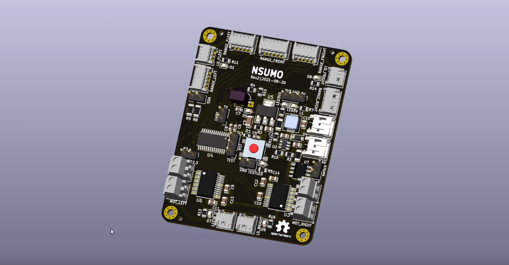

In the last video, I started going over the hardware of the sumobot by talking about its parts. In [this video](https://www.youtube.com/watch?v=ef_aFIC6Iiw), I continue by explaining the printed circuit board (PCB) I made to connect them. It's a 2-layer PCB with a microcontroller (MSP430G2553IPW28), two regulators (AMS1117-3.3 and MP2359-5V), two motor drivers (TB6612FNG), and an IR receiver (TSOP382). I designed it in KiCad, an open-source software suite for designing PCBs.

