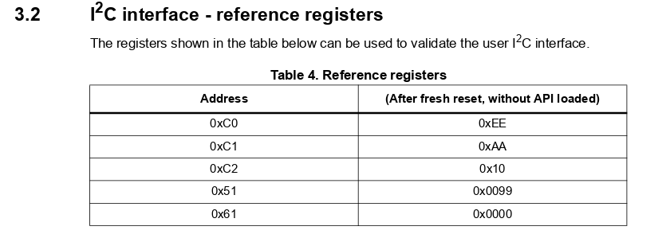
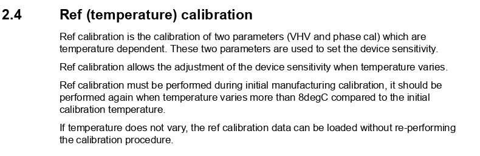

import vl53l0x_terminal_mp4 from "./vl53l0x_terminal.mp4"
import vl53l0x_terminal_webm from "./vl53l0x_terminal.webm"
import Gist from "react-gist"

In [my previous post](mcu-i2c-driver), I went into details on how to write a driver for the VL6180X.
In this post, I want to continue by implementing a driver for another time-of-flight sensor from ST,
the VL53L0X. I won't go into details about I2C in this post. Instead, I will
re-use the I2C layer as for the VL6180X and only focus on the VL53L0X-specific parts.

As I began implementing the driver for VL53L0X, I quickly realized it was harder to get
working than the VL6180X because it's a more complex and configurable sensor.
On top of that, [ST has focused on providing a "not-so-good" API driver
instead of comprehensive documentation](https://community.st.com/s/question/0D50X00009XkeHcSAJ/vl53l0x-register-map).

The quick route to get the VL53L0X working is to pull in the entire [API driver](https://www.st.com/en/embedded-software/stsw-img005.html)
from ST and only implement the lower I2C drivers specific to your microcontroller. The downside of this
is that you have to include their bloaty (and potentially buggy) code, which is a problem if you are
trying to minimize the [memory footprint](https://en.wikipedia.org/wiki/Memory_footprint).
Therefore, it's often preferable to implement your driver and only use the vendor
code as a reference.

In this post, I will create a minimal driver to initialize and do a single range measurement
with the VL53L0X. This will be helpful to those of you who are trying to write a custom driver
for the VL53L0X. I will also add support for multiple VL53L0X, and give you some more information
to help you tailor the VL53L0X for your application.

<Video mp4={vl53l0x_terminal_mp4} webm={vl53l0x_terminal_webm} />

# The code
All of the code is available at [GitHub](https://github.com/artfulbytes/vl6180x_vl53l0x_msp430),
and I also share parts of it as gists in this post. The easiest way to follow along is to pull
down the repo from GitHub and then use interactive git rebase (_git rebase -i --root_) because
I have basically made a new commit after each section.

# About VL53L0X
The VL53L0X measures range by emitting light from a laser and measuring the light reflected
back on its array of [SPADs](#spad-management).

Like the VL6180X, the VL53L0X has a microcontroller on board, handling the computation and configuration, and interfaced with I2C.

It measures a range between ~0-2 meters at up to 50 Hz, but the exact performance depends on
your configuration and operating conditions.

See [ST's documentation](https://www.st.com/en/imaging-and-photonics-solutions/vl53l0x.html#documentation)
for more details.

**NOTE:** _Be careful when you solder the header pins, so you don't melt the sensor case as I've done in the image above._

# How to hook up the VL53L0X
Just as in [my previous post](mcu-i2c-driver), I will use a VL53L0X breakout board and hook it up
to a [MSP430 LaunchPad](https://www.ti.com/tool/MSP-EXP430G2). All the breakout boards
that I've seen have the same pinout:

| Pin | Description |
| --- | ----------------- |
| VIN | Support 5 V or 3.3 V (double-check your breakout board to make sure)  |
| XSHUT | Set sensor in reset (useful for multi-sensor support, otherwise can be left unconnected) |
| GPIO0 | Interrupt pin (can be left unconnected if polling) |
| GND | Ground |
| SDA | I2C data line |
| SCL | I2C clock line |

At minimum - when using a single sensor and no interrupt - you must connect four pins: SDA, SCL, VIN, and GND.
My setup looks like this:

As you can see, I've moved the MSP430 DIP package from the launchpad to the solderless board. I find this makes the
prototyping a bit cleaner. If you do this, don't forget to connect the reset pull-up resistor to stop the MSP430
from endlessly rebooting. You should also connect a bypass capacitor (~0.1 uF) to prevent the current surge from the VL53L0X
from reseting the MSP430.

# Tip: Verify the VL53L0X with an Arduino
There are several Arduino libraries for the VL53L0X, and they only take 5 minutes to set up. If you have an Arduino,
please use it to sanity-check that your VL53L0X works before writing your own driver to avoid wasting time
on a faulty sensor.

* [Pololu's Arduino library](https://github.com/pololu/vl53l0x-arduino)
* [Adafruit's Arduino library](https://github.com/adafruit/Adafruit_VL53L0X)

# Verify the I2C communication
Building on top of the I2C driver from [my previous post](mcu-i2c-driver), we should create
a function to verify that we can talk to the VL53L0X. The simplest way is to read a register with
a known value. The datasheet suggests several registers:

The first one, 0xC0, contains the device model id, which is always 0xEE for VL53L0X.
If we read the value 0xEE from this register, we know that the VL53L0X is up and that
the I2C communication works.

<Gist id="4398a51a97bc0c5a5886c1cf7a0ff8b1" />

Running in debug mode, you should see:

_**NOTE:** The registers on the VL53L0X are 8-bit addressed (NOT 16-bit addressed as on the VL6180X).
Make sure you use the 8-bit version of the I2C functions._

# A minimal driver
The VL53L0X is a complex sensor with many configurable registers. I won't cover them all,
instead, I aim to provide you with a minimal driver example that is capable of doing a
single range measurement.

Since ST's documentation lacks vital information, I've had to study the code they provide as
well as the library by Pololu, and after some trial and error extracted the necessary bits.

Similar to the VL6180X driver, I put all of the code for the VL53L0X driver in two files _drivers/vl53l0x.h_ and
_drivers/vl53l0x.c_.

# How to initialize the VL53L0X
There are several steps to initialize the VL53L0X, and the datasheet provides an overview
of them:

The necessary steps are _device initialization_ and _temperature calibration_. We can skip the _SPAD_, _Offset_, and _Crosstalk calibration_ for our minimal driver because the default values are
good enough. These extra calibration steps are necessary when you use a cover glass.
Though, you may want to do _SPAD calibration_ later on even if you don't have a cover glass
(for more info, see [SPAD management](#spad-management)).

Once again, it's helpful to define the registers at the top of the C file. ST unfortunately
doesn't provide a complete register map for the VL53L0X, so instead, we have to extract the values from the
code they provide.

<Gist id="5f03cb796a6ab6e9c1bd7ad33856d356" />

## Device initialization
The _device initialization_ is divided into two steps, _data initialization_ and _static initialization_.

_Data initialization_ sets the voltage mode (1v8 or 2v8), the I2C mode (standard or fast), and
retrieves the value for the stop variable. The stop variable is used for initiating the stop
sequence when doing range measurement. It's not obvious why this stop
variable exists.

I set the voltage mode to 2v8 because that's what my breakout board is designed for (and
probably most others). I set the I2C mode to standard because the I2C driver is configured
for standard mode (100 kHz).

<Gist id="7b222591f6612d8a5acda40d0781dd8b" />

_Static initialization_ loads the default tuning settings, enables interrupt, and sets the sequence steps.

ST provides the default tuning settings (without explanation) in their API driver.

<Gist id="21beb6e88cf33d9679cb0f309f29d6cf" />

Interrupt settings are explained a bit more in section 6.8 of [UM2039](https://www.google.com/url?sa=t&rct=j&q=&esrc=s&source=web&cd=&ved=2ahUKEwj67Zq8pZjyAhVD-yoKHYviCM0QFnoECAQQAw&url=https%3A%2F%2Fwww.st.com%2Fresource%2Fen%2Fuser_manual%2Fdm00279088-world-smallest-timeofflight-ranging-and-gesture-detection-sensor-application-programming-interface-stmicroelectronics.pdf&usg=AOvVaw3un_hZht-P4RhO0KblWPF4). Even if we are not using the
interrupt pin, we must still enable interrupt to poll the interrupt register.
I also configure the pin to be active low since my breakout board pulls the pin up by default.
Lastly, we should ensure the interrupt is cleared.

<Gist id="52861dfbd456c882d6f39daeb7c684cf" />

The range measuring process is divided into a sequence of steps, and we should explicitly enable
the steps we want to use. They have not explained in detail anywhere, but there are five of them:

| Sequence step | Description (my guess) |
| -------- | ----------- |
| Minimum signal rate check (MSRC)  | Check if the signal rate is below a certain threshold, return error value if it is |
| Target CentreCheck (TCC) | Check to see if the target is centered? |
| Dynamic SPAD selection (DSS) | Dynamically select the active SPADs to avoid saturating from too much light |
| Pre Range | First stage of range measuring (I don't know what it does) |
| Final Range | Second stage of range measuring (I don't know what it does) |

Following what ST does, I enable everything but MSRC and TCC.

<Gist id="ee9516c175c049722a58b5ea2aad9e4a" />

And the full static_init function:

<Gist id="d66e197a9c16b8ae88213b0da05adc1a" />

## Temperature calibration
Apart from the basic initialization, we need to calibrate to compensate for temperature, which is
explained in the [datasheet](https://www.st.com/resource/en/user_manual/um2039-world-smallest-timeofflight-ranging-and-gesture-detection-sensor-application-programming-interface-stmicroelectronics.pdf):

Glancing at the ST API driver once again, I created the corresponding code:

<Gist id="67f79623115cbdb63bbbce14129cfbc2" />

Finally, we should define the "public" init function, which calls all of the
init functions we have defined.

<Gist id="5b397c8f4e6a8d0b7ad5de8ccc1c48b0" />

After calling this function, the sensor is ready for range measuring.

For the complete code until this point, look at [this commit](https://github.com/artfulbytes/vl6180x_vl53l0x_msp430/tree/74077f757891038e91d9229ce346d8c920343264).

# Single range measurement
Once the sensor is initialized, it only takes a few lines of code to do a single
range measurement. These are the steps:

1. Stop any ongoing range measuring
2. Trigger a new range measurement
3. Wait for it to start
4. Poll interrupt
5. Read range
6. Clear the interrupt

And in code:

<Gist id="037b3666136441521e2a9f7880a28aa4" />

[The complete code until this point](https://github.com/artfulbytes/vl6180x_vl53l0x_msp430/tree/74077f757891038e91d9229ce346d8c920343264).

# Multi-sensor support
We got a single sensor working, but let's also add multi-sensor support.

When using multiple VL53L0X on the same I2C bus, we have the same problem as with the
VL6180X, we get bus collision because they share the same default I2C address. We solve it
the same way: put all sensors in hardware standby and then power them up and
configure their address individually. This solution is described in the application
note [AN4846](https://www.google.com/url?sa=t&rct=j&q=&esrc=s&source=web&cd=&cad=rja&uact=8&ved=2ahUKEwi35MnZyJnyAhVGpIsKHYpADdkQFnoECAcQAw&url=https%3A%2F%2Fwww.st.com%2Fresource%2Fen%2Fapplication_note%2Fan4846-using-multiple-vl53l0x-in-a-single-design-stmicroelectronics.pdf&usg=AOvVaw1gsS6wE0wQB6f2BR1CKrqs).

## How to hook up multiple VL53L0X
Besides connecting the sensors to the VCC, GND, SDA, and SCL pin, we should also connect the XSHUT/GPIO0 pin
for hardware standby. I will be using three sensors as an example and connect their XSHUT to p1.0, p1.1
and p1.2 of the MSP430.

**NOTE:** _Consider the pull-up resistance if you use many breakout boards. The effective resistance
may become too low if you use many breakout boards, and you may need to desolder the pull-ups from some
of them. Though three boards worked fine for me (~3.3 kOhm pull-up)._

## Modify the driver to support multiple sensors
The code is almost identical to VL6180X, so please read [my other post](mcu-i2c-driver) for more
details. One difference is that there is no "fresh out of reset" register, so we read the
device id register instead. Another is that VL53L0X returns 8190 or 8191 when nothing is
blocking them, but this is by default. Note, I'm not sure, but the limit checks may affect this return value
(see [Ranging profiles](#ranging-profiles)).

The new code (probably easier to study [the commit on GitHub](https://github.com/artfulbytes/vl6180x_vl53l0x_msp430/tree/e5e895f8150d3d56e41b571badeaef26355b4aeb)):

<Gist id="90b31ec3df0c8caf2e8e3630882b5ac9" />

# Additional notes
This post aimed to give you a minimal code example for VL53L0X. There is much more you
can configure to better adapt the VL53L0X for you application. I won't go into everything, but
I do want to talk about some of it in this section.

## SPAD management
One thing that ST doesn't explain in detail is the configuration of the SPAD array.

The [single-photon avalanche diodes (SPADs)](https://en.wikipedia.org/wiki/Single-photon_avalanche_diode) array is
the set of diodes that measures the reflected light that's emitted by the laser. The VL53L0X has 16x16 = 256 of
them, but only a handful of them should be used to achieve a good signal rate. Exactly which SPADs to enable
depends on the particular VL53L0X, operating conditions, and whether a cover glass is used or not.

During production, ST calibrates and generates a good reference SPAD map, which marks the best diodes (I think)
among the 256 diodes. This map is different for each VL53L0X unit, and ST saves it to the non-volatile memory (NVM).

From what I've extracted, we basically have three options for configuring the SPADs:

**Option 1: Do nothing**: By default, the SPADs are enabled according to the good reference SPAD map

**Option 2: Enable a subset of the good reference map**: Only a subset of the good reference SPAD map should be enabled for optimal signal rate. ST also saves the number and type of SPADs to enable from the good reference SPAD map, which is based on the SPAD calibration they run in production. We can retrieve these values from NVM to reconfigure the SPAD map accordingly.

**Option 3: Run SPAD management calibration:** We can run the SPAD management calibration ourselves to determine the best SPADs to enable from the good reference SPAD map.

I quickly compared all three using a breakout board (no cover glass) and in relatively normal operating
conditions. In my case, the difference is small, but **option 2** gives slightly better readings than **option 1**, and
**option 3** slightly better than **option 2**. The difference is likely much more noticeable with a cover glass.

The code we have written so far relies on **option 1**. I will go ahead and also implement **option 2**, but
then only discuss **option 3**.

### SPADs
Before moving on, there are a few things you should know about the SPADs.

There are two types of SPADs,  _aperture_ and _non-aperture_, and only one type of SPAD should
be enabled simultaneously. ST doesn't explain the difference between these two, but if it's
related to the [aperture](https://en.wikipedia.org/wiki/Aperture) concept of a digital camera,
it probably means that the aperture SPADs are covered to capture less light.

In total, there are 16x16=256 SPADs divided into four quadrants where the third quadrant is non-aperture
and the rest is aperture. And if I've interpreted ST's code right, we should only enable SPADs
within an area of 44 SPADs. ST has also hardcoded the start of this area to the 180th diode,
meaning the area only spans the third and fourth quadrant.

### Option 2: Load SPAD config from NVM
To load the SPAD configuration from the NVM, we must set up the registers to read the data from NVM,
and then create and write the SPAD configuration accordingly. We should do this as part of the _static
initialization_.

Below I've extracted the required parts from the ST driver and tried to simplify it as much
as possible:

<Gist id="ab4e497f302e0c5d7414f630af3a5c3b" />

**NOTE:** _To save some lines of code, we can read the good reference SPAD map directly from the
SPAD configuration register instead of from the NVM._

### Option 3: Reference SPAD calibration
To get the best SPAD configuration, you should do SPAD calibration, which ST further explains:

I won't implement it, but if you are interested, you should refer to _VL53L0X_PerformRefSpadManagement_ in
ST's API code. It takes some tedious code to get this working, so before you do, measure the difference with an Arduino
first (Adafruit's library has support). You could also take a shortcut by extracting the resulting SPAD map
using the Arduino and hard-code those values in your code.

**NOTE:** _SPAD calibration doesn't produce a new reference SPAD map. It only finds an optimal subset of
SPADs to activate from the good reference map already stored in the NVM._

**NOTE:** _Every sensor unit is unique, so you must run the SPAD calibration for each sensor._

## Ranging profiles
Apart from configuring the SPAD map, you can configure the VL53L0X with different ranging
profiles for a trade-off between speed, accuracy, and range. ST provides four example profiles:

The API document explains what you need to do to configure each example profile. If you want something
other than the default profile, you should read the API documentation and refer to these ST API functions:

_VL53L0X_SetLimitCheckValue_: Change the limit checks, i.e., longer range at the cost of more false positives

_VL53L0X_SetMeasurementTiming BudgetMicroSeconds_: Set the total time allowed for single range measurement, i.e., shorter time at the cost of accuracy.

_VL53L0X_SetVcselPulsePeriod_: Change the laser pulse period. A longer pulse period potentially gives a longer range.

## Continuous (timed) mode
The VL53L0X can operate in two modes: _single_ and _continuous_. In _single mode_, which we used in previous
sections, we must start the range measuring each time. In _continuos mode_, range measurements run
automatically one after another, immediately or with a set interval (intermeasurement period).
If you want to use _continuous mode_ you should refer to the following ST API functions:

_VL53L0X_StartMeasurement()_

_VL53L0X_SetInterMeasurementPeriod MilliSeconds()_

_VL53L0X_GetInterMeasurementPeriod MilliSeconds()_

## Other things to look into

**Improve initialization time:** It's unnecessary to do the calibration each power-up. You can cut down startup time
by saving the values to persistent memory

**Interrupt:**
It's generally a good idea to wait for an interrupt rather than polling a register, especially if you configure the sensor to operate in continuous mode.

**Error handling:**
I've kept error reporting to a bare minimum. You may want to report and handle errors better in your application.

**Cover glass:** If you use a cover glass, you must do the additional calibration.

**Many sensors:** A tip is to add a GPIO expander if you use many sensors and run out of pins on your
microcontroller. You may also want to use different range profiles for the individual sensors.

**Gesture recognition:** VL53L0X is not only for range measurement, it also supports gesture recognition.

# Recommended reading
First of all, have a look at [the previous post](mcu-i2c-driver).

The bulk of the documentation is to be found at [ST's page for VL53L0X](https://www.st.com/en/imaging-and-photonics-solutions/vl53l0x.html#documentation):
* [User manual UM2039](https://www.st.com/resource/en/user_manual/um2039-world-smallest-timeofflight-ranging-and-gesture-detection-sensor-application-programming-interface-stmicroelectronics.pdf)
* [UM2039 API manual](https://www.st.com/resource/en/application_note/an4846-using-multiple-vl53l0x-in-a-single-design-stmicroelectronics.pdf)
* [AN4846 Using multiple sensors](https://www.st.com/resource/en/application_note/an4846-using-multiple-vl53l0x-in-a-single-design-stmicroelectronics.pdf)
* [A power point describing the technology in VL53L0X, VL6180X, and VL53L1X](https://www.st.com/content/ccc/resource/sales_and_marketing/presentation/product_presentation/group0/e0/84/0c/fb/11/ec/49/1d/SensorsLive_LiDAR_Chip/files/SensorsLive_LiDAR_Chip.pdf/jcr:content/translations/en.SensorsLive_LiDAR_Chip.pdf)

Have a look at the Arduino libraries as well, especially the one from Pololu because it doesn't rely on
ST's API code.

* [Pololu's Arduino library](https://github.com/pololu/vl53l0x-arduino)
* [Adafruit's Arduino library](https://github.com/adafruit/Adafruit_VL53L0X)

# Final words
I must admit it was a hassle to get this sensor working. On paper, the VL53L0X is a
powerful range sensor in a small package for an affordable price, but its complexity
and incomplete documentation makes it time-consuming to set up. ST does provide an extensive
driver layer, but many times, you don't want to pull in an entire third-party driver layer
into your project.

I have provided you with a minimal and portable code example for getting
the VL53L0X up and running. In addition, I have given you information to help you
better configure the VL53L0X for your application.

[The complete code here](https://github.com/artfulbytes/vl6180x_vl53l0x_msp430).

