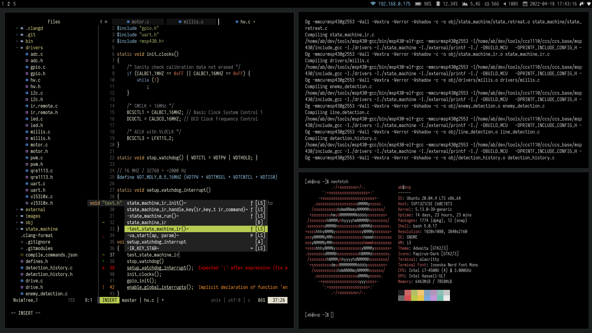
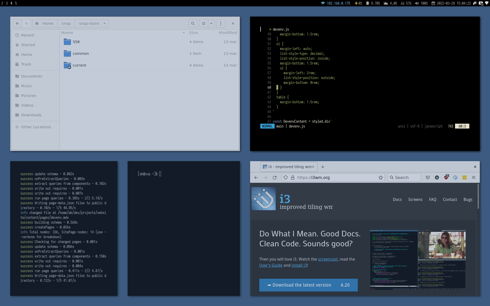
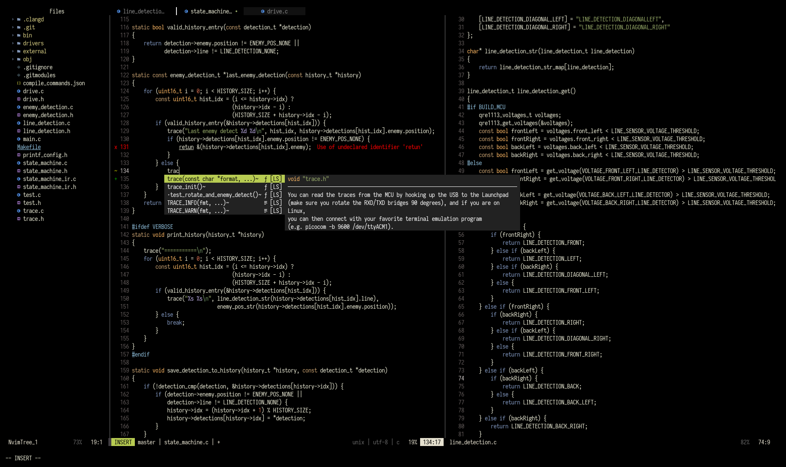
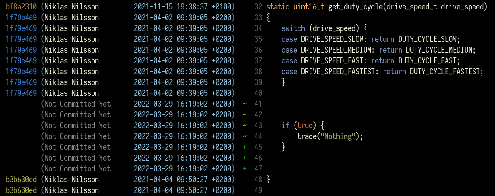
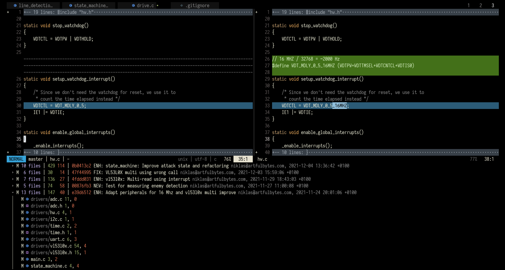

import lsp_example_mp4 from "./lsp_example.mp4"
import lsp_example_webm from "./lsp_example.webm"
import fzf_example_mp4 from "./fzf_example.mp4"
import fzf_example_webm from "./fzf_example.webm"

# My development environment
On this page, you will find some notes about my development environment. Just as for any craftsman, tools 
help you do your job faster and better. As a software developer, it's about reducing the effort to take a solution from my head and
translate it into code. Good software tools allow me to spend less time on mundane and repetitive tasks.

## Summary
| |
| ----------- | ----------- |
| Distribution | Ubuntu 20.04 (64-bit) |
| Window manager | [i3](#window-manager-i3)       |
| Editor | [Vim](#editor-vim) |
| Terminal | Alacritty |
| Browser | Firefox |
| Dotfiles manager | [yadm](#dotfiles-manager-yadm) |
| Status bar | i3blocks |
| Font | [Iosevka](#font-iosevka) |
| Image view | sxiv |
| PDF viewer | zathura |
| Program launcher | j4-dmenu-desktop |
| File manager | Nautilus |
| Media player | VLC |
| Login manager | gdm3 |

**[Find my dotfiles here.](https://github.com/niklasab/dotfiles)**

## Rules
I want my development environment to be

* Easy to customize
* Easy to maintain
* Easy to setup (Ideally, [a single command](#bootstrap-and-manage-dotfiles) to set it up)
* Version-controlled (and documented)
* Keyboard-driven (I don't want to use my mouse)
* Suitable for embedded work (C/C++)

# Linux
I've run Linux for almost ten years now. I can't see myself running any other operating system. Linux
lets me customize my system to the way I want it; it allows me to automate the things that can be automated;
and it provides me with the set of tools I need for working with software. Everything is organized neatly and follows principles that makes sense for a software developer. Moreover, knowledge of
Linux is essential as an embedded engineer since so many embedded systems run it these days.

_A computer is like air conditioning - it becomes useless when you open Windows._

\- Linus Torvalds

## Why I use Ubuntu
Even though I like setting up my system from scratch and knowing what software I've
installed, I run the Ubuntu distribution, which is completely the opposite of that idea. The reason is that
I also want my system to be easy to maintain. The bloat nags me, and I have the occasional urge to switch
to Arch Linux, but Ubuntu's ease of use so far outweighs any reason I have to leave it.

## Window manager: i3
I'm not a fan of stock Ubuntu, however, so I have tweaked it to the point of being unrecognizable from
the stock environment. Partly inspired by [Regolith Linux](https://regolith-linux.org/), I've replaced
Ubuntu's floating window manager with i3, a tiling window manager. I launch i3 through a gnome-session
by using [i3-gnome-flashback](https://github.com/regolith-linux/i3-gnome-flashback) to keep the system management capability of Ubuntu (e.g., display, wifi, key manager...).
Together with i3, I use Picom (composite manager) for shadows and gaps, i3blocks as status bar, and j4-dmenu
to launch programs.

A tiling window manager is a game-changer for anyone who likes a keyboard-driven workflow.

# Editor: Vim
I use Vim (Neovim) as my main editor because I tried it out many years ago, it stuck with me,
and it's hard to get out once you are in. I'm not sure Vim is worth the effort, and if I started today, I
would seriously consider Visual Studio Code (VS code). Of course, as an embedded developer, I also find myself in
IDEs that vendors "force" me to use.

Vim has been around for a long time, but it's still actively developed with a solid user base,
especially since the release of [Neovim](https://github.com/neovim/neovim), a fork of Vim that
has propelled the development towards a better codebase with asynchronous features, Lua, language
server support, and more. It's an exciting time to be using Vim.

You find my vim config [here](https://github.com/niklasab/dotfiles). In the following sections, I highlight the essential plugins I use.
Note that my current config has most of what I need, but it's not perfect.

## Language server: Coc
One defining feature of a good IDE is its capability to do auto-completion, linting, jump between definitions,
and syntax highlighting. In the VS code vocabulary, this is referred to as [IntelliSense](https://code.visualstudio.com/docs/editor/intellisense). VS code achieves these features through [language servers](https://en.wikipedia.org/wiki/Language_Server_Protocol). What's nice about language servers is that they are separate from the editor, which makes it possible (and easy) to leverage the the same IntelliSense features in Vim.

There are several plugins to make Vim work with language servers; Neovim even has native LSP support nowadays, but
I haven't made the move yet, instead, I use a plugin called Coc.nvim. In addition, I use the Clangd language server for C/C++ development.

<Video mp4={lsp_example_mp4} webm={lsp_example_webm} />

## Fuzzy finder: FZF and ripgrep
FZF (a command-line fuzzy finder) and ripgrep (a better grep) are two other must-haves for me. These
two complementing tools make file and code navigation incredibly fast. Probably best demonstrated with
an example:

<Video mp4={fzf_example_mp4} webm={fzf_example_webm} />

There is also a popular (and supposedly better) fuzzy finder plugin called Telescope.nvim, which I haven't gotten around
to try yet.

## Version control: Fugitive, Gitgutter, diffview
Another central part of my workflow is Git. I have three plugins to integrate Git with Vim better.

**gitgutter** is the one I use the most. It appears as a left bar (a "gutter") with a symbolic summary of the
modifications (hunks) made in the current file. It allows me to stage, undo and navigate between
modified hunks quickly.

The second one I use is **vim-fugitive**, though so far, I only use its git-blame feature, but it has many
other nice features I would like to try.

Finally, I use **diffview** to get a summarized view of individual commits.

# Bootstrap and manage dotfiles
One area where Linux shines is automation, and a great example of this is that I can write a single "bootstrap" script to
set up my entire development environment, which is exactly what I've done. A bootstrap script makes setting up a new computer
easy. It also gives me a convenient way to version control my setup; Every time I make a new change, I commit it to
my bootstrap script. You find this script in my [dotfiles](https://github.com/niklasab/dotfiles) under _.config/yadm/bootstrap_.

## Dotfiles manager: Yadm
My Linux setup relies on many configuration files, and to keep track of them, I use Yadm, a tool that lets you version
control your dotfiles nicely with Git. By nicely, I mean it keeps the git repository separate from the home folder, and
there is no need to system link files.

# Font: Iosevka
As a programmer, you look at text all day, so you want a good font. I use the horizontally compact font Iosevka (Terminal Monospace)
patched with [Nerdfont](https://www.nerdfonts.com/) (to get glyphs in Vim). If you are looking for a good font, you can use [this
website](https://devfonts.gafi.dev) to compare popular programming fonts.

