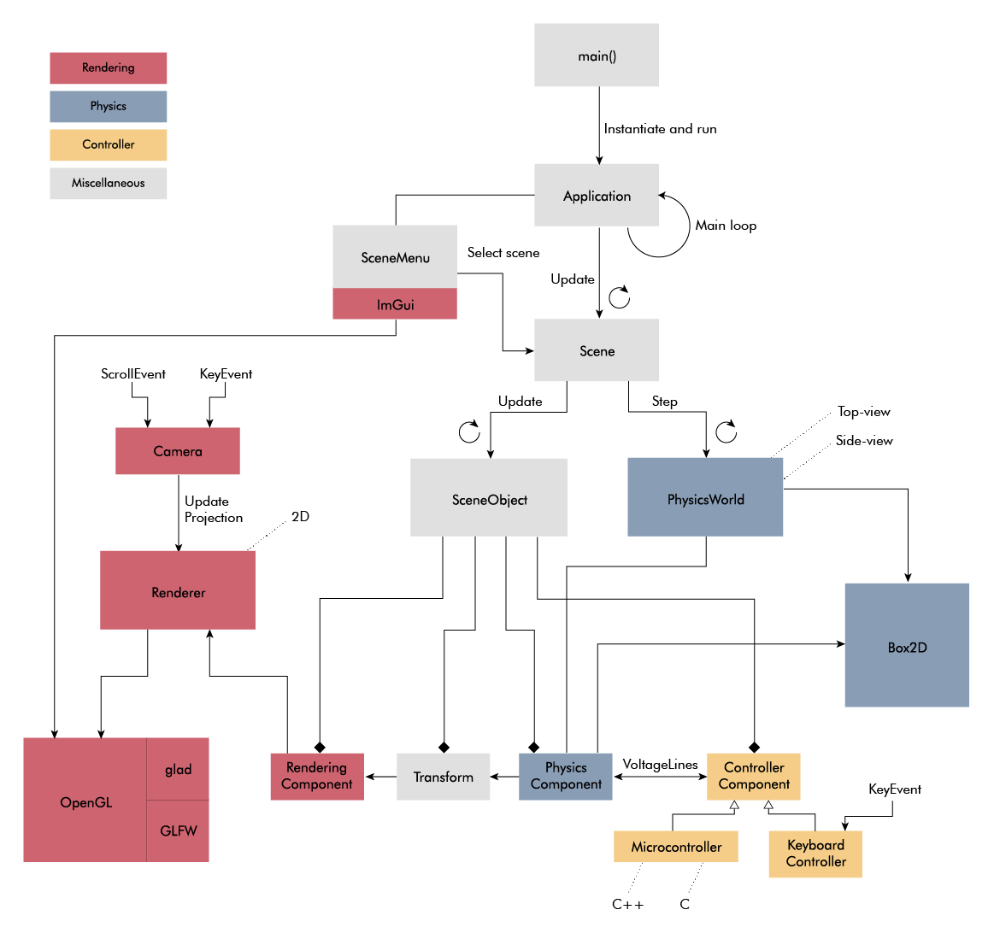

import linefollower_mp4 from "./linefollower.mp4"
import linefollower_webm from "./linefollower.webm"
import sumobot_testscene2_mp4 from "./sumobot_testscene2.mp4"
import sumobot_testscene2_webm from "./sumobot_testscene2.webm"

## Background
While building my [sumobot](/sumobot) I found myself wanting to simulate my driving strategy. My sumobot is simple, so I didn't need a fancy 3D-simulator, and I went looking for a 2D-simulator instead. To my surprise, I couldn't find an obvious candidate, so I decided to build my own.

## Features
My initial plan was to build a 2D-simulator only for simulating sumobots, but I ended up creating a more general 2D simulation framework featuring:
* Open-source (MIT license)
* C++
* Linux and Windows support
* Physics based on Box2D
    - Top-view and side-view
* Lightweight rendering using OpenGL, GLFW, GLAD and ImGui
    - Basic shapes, Texture, Sprite animation
* Robotics assets
    - Complete robots (sumobot and line-follower)
    - Sensors (range sensor, line detector)
    - Actuators (DC-motor)
    - Playgrounds (Sumobot dohyo, Line follower path)
    - Isolated controller code (easy to transfer to a real MCU)
    - It's easy to add new assets...

You can read more about the project in my [lengthy blog post](/bots2d-blogpost).

## Source code
You find [the code](https://github.com/artfulbytes/bots2d) over at Github.

## Images

<Video mp4={sumobot_testscene2_mp4} webm={sumobot_testscene2_webm} />

<Video mp4={linefollower_mp4} webm={linefollower_webm} />
