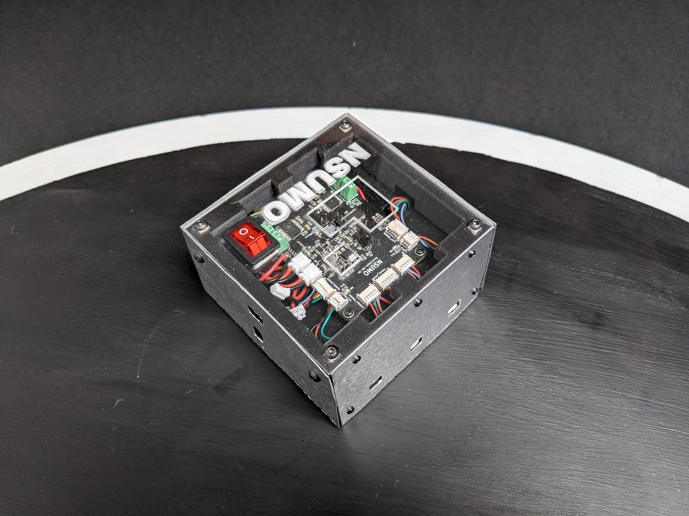
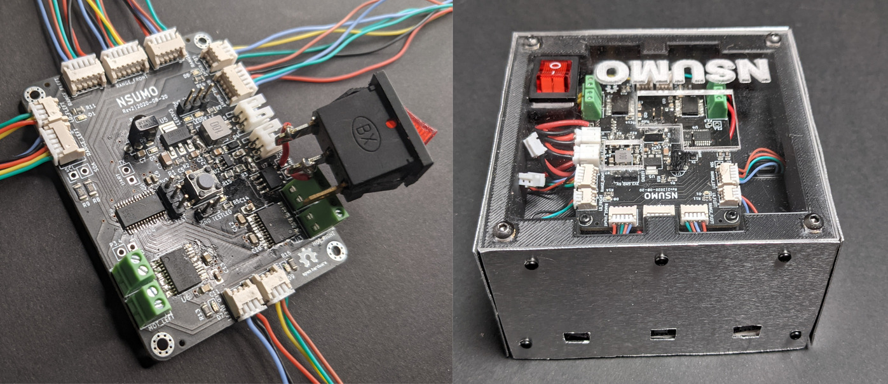
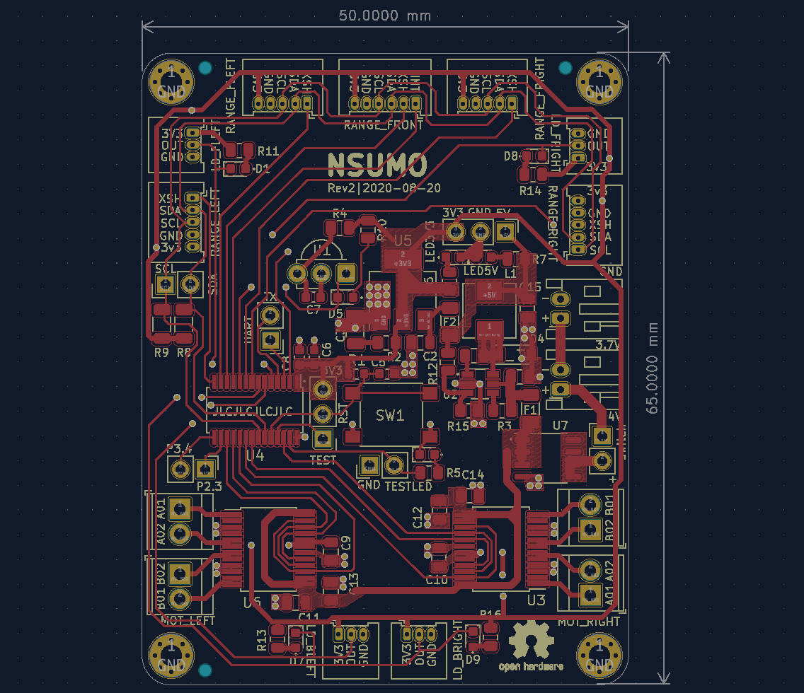
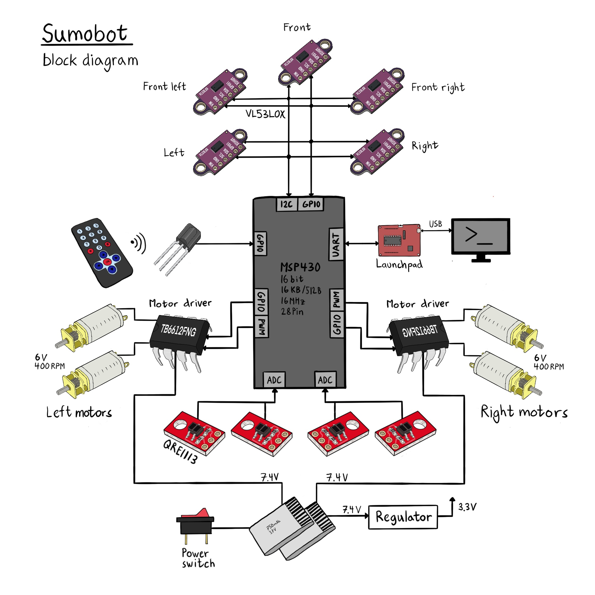

import testing_led_mp4 from "./testing_led.mp4"
import testing_led_webm from "./testing_led.webm"
import four_motors_driving_mp4 from "./four_motors_driving.mp4"
import four_motors_driving_webm from "./four_motors_driving.webm"
import paint_it_black_mp4 from "./paint_it_black.mp4"
import paint_it_black_webm from "./paint_it_black.webm"
import robot_controlled_mp4 from "./robot_controlled.mp4"
import robot_controlled_webm from "./robot_controlled.webm"
import robot_is_born_mp4 from "./robot_is_born.mp4"
import robot_is_born_webm from "./robot_is_born.webm"
import robot_spin_fast_mp4 from "./robot_spin_fast.mp4"
import robot_spin_fast_webm from "./robot_spin_fast.webm"

## Background
A popular sports in robotics is [robot-sumo](https://en.wikipedia.org/wiki/Robot-sumo) and similar to
regular sumo wrestling, there are two competitors trying to push each other out of a ring (dohyo), but instead of hefty
men from Asia, the two competitors are robots called sumobots.

There are many classes you can compete in, among the most popular are:
* Standard: 20cm x 20cm x 3kg
* Mini: 10cm x 10cm x 500g
* Micro: 5cm x 5cm x 100g

Besides giving rise to a competition, a sumobot is a great project for learning about robotics
and embedded systems development. It involves the typical parts of a robot (microcontroller, sensors, motors, and battery), and on top of that, you must implement an autonomous driving strategy.

## Features
* Mini-class (10cm x 10cm x 500g)
* Microcontroller MSP430
* Bare-metal C
* Custom PCB
* Four motors/wheels with skid-steering
* 3D-printed chassis

The [hardware design](https://github.com/artfulbytes/nsumo_hardware) and [software](https://github.com/artfulbytes/nsumo_software) are available at [GitHub](https://github.com/artfulbytes).

## Images

